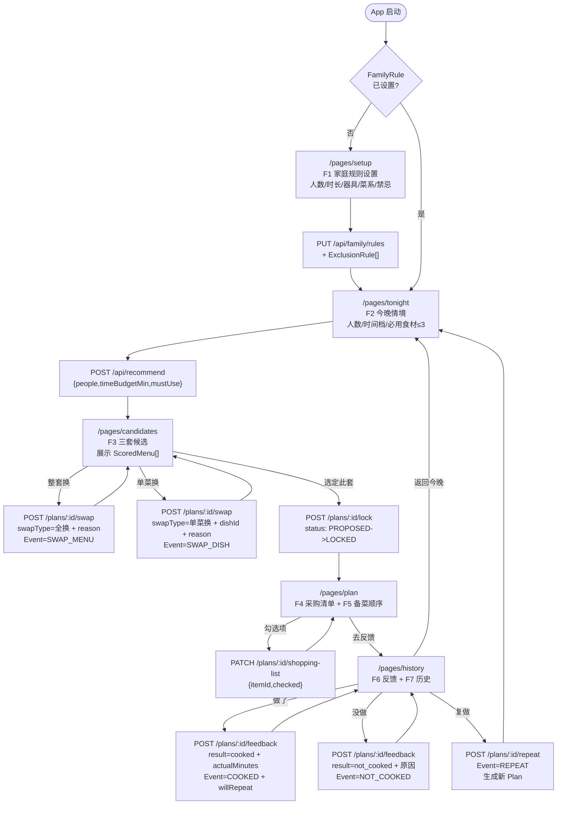
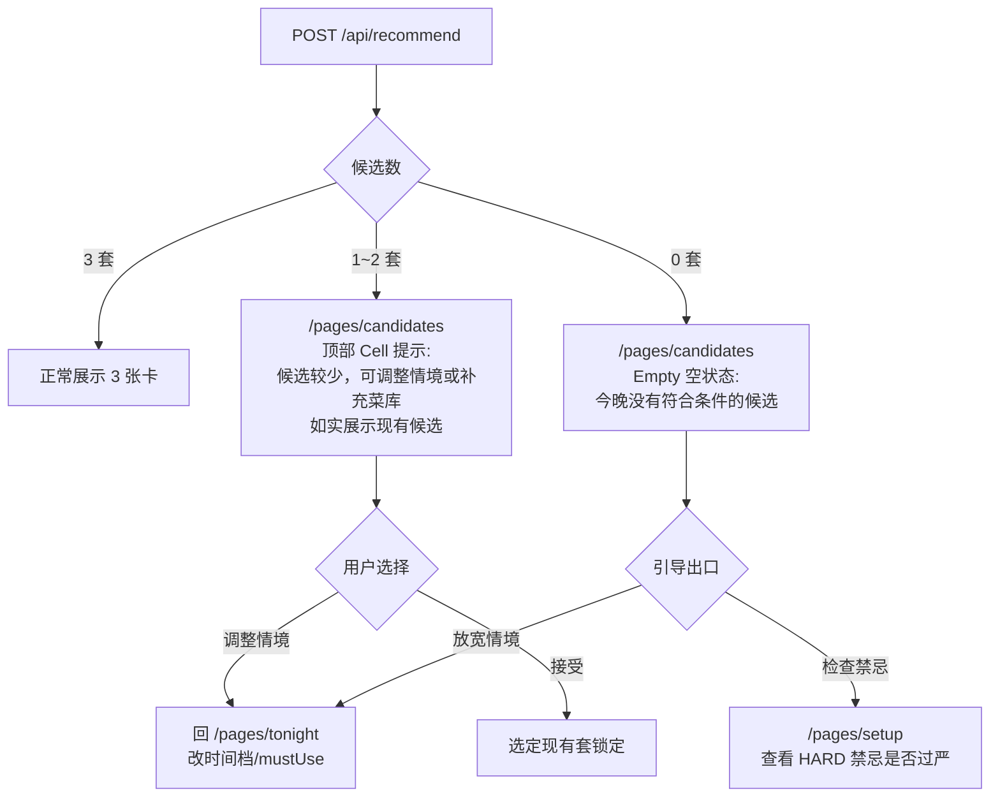
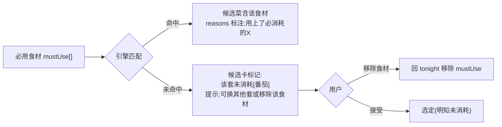
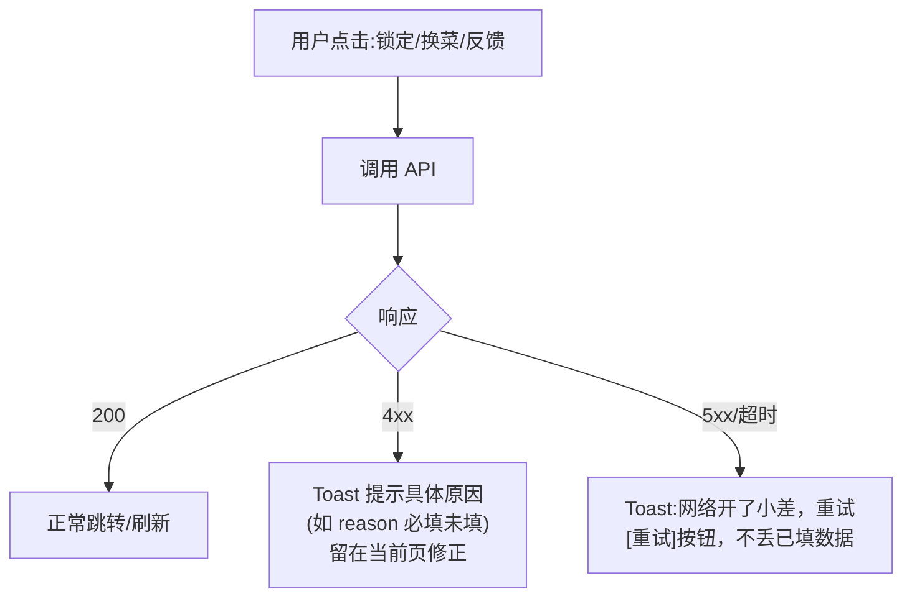

# 关键流程交互图（Interaction Flow）

> 产物归属：UI/UX 设计 Agent｜对齐实施方案「环节 2.5」门禁：可用性走查「关键路径可完成、无死胡同」
> 设计依据：shared v0.1 契约（Plan/Event/Candidate/Swap/Feedback）+ engine `RecommendResult{candidates,filtered}`
> 配套：[wireframes.md](./wireframes.md) 5 页面线框图

---

## 1. 完整用户路径（主流程）

设置 -> 今晚输入 -> 候选 -> 锁定 -> 清单 -> 反馈 -> 历史/复做



---

## 2. 节点操作与跳转说明

| 步骤 | 页面 | 用户操作 | 触发请求 | 跳转 | 状态变化 |
|---|---|---|---|---|---|
| 1 | 启动 | 打开 App | `GET /api/family/rules` | 无规则->setup；有规则->tonight | - |
| 2 | /pages/setup | 填人数/时长/器具/菜系/禁忌，点保存 | `PUT /api/family/rules` | -> tonight | FamilyRule 落库 |
| 3 | /pages/tonight | 调人数/选时间档/选必用食材(≤3)，点推荐 | `POST /api/recommend` | -> candidates | Plan(status=PROPOSED) 生成 |
| 4 | /pages/candidates | 浏览3套，可整套换/单菜换 | `POST /plans/:id/swap` | 留在本页刷新候选 | Event(SWAP_*) |
| 5 | /pages/candidates | 选定某套，点锁定 | `POST /plans/:id/lock` | -> plan | status: PROPOSED->LOCKED |
| 6 | /pages/plan | 勾选采购项 | `PATCH /plans/:id/shopping-list` | 留在本页 | ShoppingList.checked 更新 |
| 7 | /pages/plan | 切备菜Tab看时间轴 | (本地渲染 prepSequence) | 留在本页 | - |
| 8 | /pages/plan | 点去反馈 | (带 planId) | -> history | - |
| 9 | /pages/history | 选做了+实际耗时+结果+下次还做 | `POST /plans/:id/feedback` | 留在本页 | status->COOKED；Event=COOKED/REPEAT |
| 10 | /pages/history | 选没做+原因 | `POST /plans/:id/feedback` | 留在本页 | status->SKIPPED；Event=NOT_COOKED |
| 11 | /pages/history | 点历史记录的复做 | `POST /plans/:id/repeat` | -> tonight | 生成新 Plan(PROPOSED) |

---

## 3. 异常路径

### 3.1 推荐异常（候选数 < 3 或 = 0）



- 引擎契约：`RecommendResult.candidates` 不足 3 套时如实返回，`filtered: FilterTrace[]` 记录被过滤的菜单及原因（safety/feasibility 阶段 + rule）。
- 0 套场景在候选页顶部可展开「为什么没有候选？」查看 filtered 摘要（如「3 套被硬禁忌过滤，2 套超时长」），让用户可解释、可调整，不卡死。

### 3.2 mustUse 食材无法消耗的标记



- 引擎无法保证每套都消耗 mustUse；UI 在候选卡「推荐理由」区如实标注「未消耗：番茄」，不隐瞒，把决策权交给用户。
- 不阻断锁定（用户可能就是想用掉部分食材），但标记可见。

### 3.3 锁定/换菜/反馈失败（网络/接口异常）



- 所有写操作失败用 NutUI Toast 短提示，保留表单状态，提供重试，不跳走、不清空。

---

## 4. 可用性走查（门禁：关键路径可完成、无死胡同）

### 4.1 关键路径可完成（Happy Path 走查）

| # | 路径步骤 | 预期 | 通过 |
|---|---|---|---|
| CP1 | 首次启动->setup->填规则->保存->tonight | 默认值预填，90秒内可保存并进入今晚 | [ ] |
| CP2 | tonight 三项默认值直接点推荐->candidates | 无需任何输入即可获得3套候选 | [ ] |
| CP3 | candidates 选定第1套->锁定->plan | 锁定后清单+备菜正常展示 | [ ] |
| CP4 | plan 勾选采购项->切备菜Tab->去反馈 | 勾选持久化，备菜时间轴渲染 | [ ] |
| CP5 | history 提交做了->记录入历史->复做回tonight | 反馈落库，复做生成新计划回到首页 | [ ] |

### 4.2 无死胡同（Dead-End 走查）

| # | 场景 | 出口 | 通过 |
|---|---|---|---|
| DE1 | 候选 0 套（禁忌过严） | Empty 组件 -> 去设置检查禁忌 / 回今晚调情境 | [ ] |
| DE2 | 候选 <3 套 | 顶部提示 + 如实展示，可选定或调整 | [ ] |
| DE3 | mustUse 未被消耗 | 候选卡标记，可移除食材或接受选定 | [ ] |
| DE4 | 历史空状态（首次使用） | Empty + 「定今晚吃什么」-> tonight | [ ] |
| DE5 | 网络异常（任意写操作） | Toast + 重试，留在当前页，不清空 | [ ] |
| DE6 | candidates/plan 返回 | NavBar 返回回 tonight，情境不丢 | [ ] |
| DE7 | setup 未保存误退 | 保存前返回提示「未保存」，避免规则半空 | [ ] |

### 4.3 主流程时长目标

- 「2 分钟定今晚」核心路径 = CP2 + CP3（tonight 推荐 + candidates 锁定），目标 ≤120 秒。
- 默认值全覆盖 + 单按钮主操作（推荐/选定）保证最短 2 次点击完成路径，无需输入文字（mustUse 可选填）。

---

## 5. 页面间数据流小结

```
setup  --FamilyRule/Exclusion--> [API] --入库-->
tonight --PlanContext--> POST /recommend --> candidates(ScoredMenu[])
candidates --lockedMenuId--> POST /lock --> plan
plan --ShoppingList+prepSequence--> 渲染清单/时间轴
plan --planId--> history
history --feedback/result--> POST /feedback --> Event(COOKED/NOT_COOKED/REPEAT)
history --planId--> POST /repeat --> 新 Plan --> tonight(复用)
```

所有跨页数据经 API + Plan 快照传递，前端 Zustand 仅缓存 tonight 情境与当前 PlanId，刷新可从 API 恢复，无单页强状态依赖。
