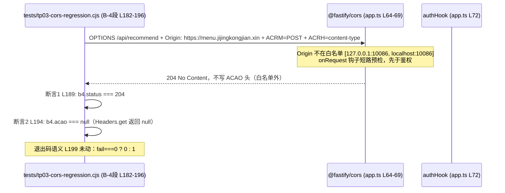

# B-4 独立技术复审报告（fm-reviewer）

> **主控落盘注记（2026-09-13）**：本报告系 fm-reviewer 独立复审返回原文，由主控逐字代落盘（reviewer 无写入工具，先例：T-C06/T-C07/LOGIN-DOM）。本轮为独立复审（独立性声明入派发单，不参考任何前轮结论）；主控实测 git 权威数字（26/0 恰 1 文件、2 hunks）作为 reviewer 输入。总判定 **PASS WITH NOTES（0C/0T/2S）**；S-1 主控裁量：vitest 直跑等价口径系派发单预授权（LOGIN-DOM 先例），不构成失实，verify 复核时优先补 pnpm 原命令实跑；S-2 主控裁量备案：`.workflow-verify/` 下物证工具不计入改动面、须保持只读（与 tp10v/dup-key/verify 先例一致）。

物证 log 实读与 dev 报告 §5 完全吻合（test-full.log L179-180：19 files/442 passed；taboo-full.log：AC12 345ms + 5 files/95 passed）。另核实 T-P03 报告（2026-09-06 成文）中无 AC2-d 断言名记录，属脚本历史版本演进，不影响本卡「既有 18 断言零改动」的判定基准（该基准由 0 删除行 + dev 报告 §2 修改前基线输出锁定）。

证据收集完毕，按 skill 二次自校验方法对全部候选发现逐条复核后，出具独立复审报告。

---

## 一、总判定：**PASS WITH NOTES**

无阻塞问题、无打回问题；2 条 S 级备注（均有先例或口径背书，不构成合并障碍）。核心事实链：主控权威 git 数字（恰 1 文件 +26/-0 纯追加、2 hunks）与文件实读内容逐行吻合；B-4 段恰 2 断言且断言逻辑严格；预期值全部有据可查（[app.ts L60](file:///d:/codex/family-menu/apps/api/src/app.ts#L60) 实读原文 + [T-P03 报告 §7/§8.3](file:///d:/codex/family-menu/evidence/T-P03-2026-09-06.md#L64) 实读原文）；证据链算术自洽、物证齐全。

**变更链路概览**（新增断言的请求与验证链路）：

## 二、分级问题清单

### C（阻塞）：无

### T（打回）：无

### S（建议，共 2 条）

| # | 问题 | 证据 | 影响与建议 |
|---|---|---|---|
| S-1 | AC4 执行口径为 vitest 直跑等价，非任务卡字面的 `pnpm test` / `pnpm test:taboo` 原命令 | [B-4-dev-2026-09-13.md §5](file:///d:/codex/family-menu/evidence/B-4-dev-2026-09-13.md#L137-L142)：以「本机 PowerShell 对 pnpm shim stdout 捕获可能失效（LOGIN-DOM 卡先例）」为由，改用 `node node_modules/vitest/vitest.mjs run --no-file-parallelism` 与 `run packages/engine/test/` | 命令与根 script 逐字符等价、数字与基线一致、派发单已载明追认该口径，不构成打回。建议 fm-verify 复核时若本机 shim 可捕获则优先补一次 pnpm 原命令实跑留档 |
| S-2 | dev 新增物证脚本 `.workflow-verify/b4/count-check.cjs`，严格字面超出任务卡 §四「只许改 tests/tp03-cors-regression.cjs（+ 新增证据报告）」的范围 | [count-check.cjs](file:///d:/codex/family-menu/.workflow-verify/b4/count-check.cjs#L25-L33)：仅 `SELECT COUNT(*)`，零写入、零删除 | 该文件位于 gitignore 覆盖目录（dev 报告 §6 L164 声明不入库），性质为 AC5 证据采集工具，与全仓先例一致（tp10v/teardown.cjs、dup-key/verify/*.mjs 等），不构成改动面。建议主控备案口径：`.workflow-verify/` 下物证工具不计入「改动面」，但须保持只读 |

## 三、AC1~AC5 逐条独立核验

### AC1（新增恰 2 断言、位置、Origin 口径、既有 18 断言逐字不变）——独立核验 [✓]

- **恰 2 条新断言**：[tp03-cors-regression.cjs L187-L191](file:///d:/codex/family-menu/tests/tp03-cors-regression.cjs#L187-L191) 断言 1 `b4.status === 204`；[L192-L196](file:///d:/codex/family-menu/tests/tp03-cors-regression.cjs#L192-L196) 断言 2 `b4.acao === null`。B-4 段全段仅此 2 处 `step(` 调用，全文件 `step(` 共 20 处（18 旧 + 2 新），与「20 PASS」输出吻合。
- **段名标注 B-4 来源**：[L174](file:///d:/codex/family-menu/tests/tp03-cors-regression.cjs#L174) 段注释「B-4（T-P03 review 建议级 #4 核销）：非白名单 Origin 预检负路径」，且头注释区 [L14-L15](file:///d:/codex/family-menu/tests/tp03-cors-regression.cjs#L14-L15) 另有 B-4 条目，双重标注。
- **位置**：AC2-d 段（[L154-L172](file:///d:/codex/family-menu/tests/tp03-cors-regression.cjs#L154-L172)）之后、结果汇总（[L198](file:///d:/codex/family-menu/tests/tp03-cors-regression.cjs#L198)）之前，符合任务卡「建议位于 AC2-d 之后」。
- **请求形态**：[L182-L186](file:///d:/codex/family-menu/tests/tp03-cors-regression.cjs#L182-L186) `OPTIONS /api/recommend` + `acrm: 'POST'` + `acrh: 'content-type'`，与任务卡 AC1 要求的 ACRM=POST + ACRH 完全一致。
- **Origin 复用**：[L183](file:///d:/codex/family-menu/tests/tp03-cors-regression.cjs#L183) `https://menu.jijingkongjian.xin` 与 AC2-d 的 [L156](file:///d:/codex/family-menu/tests/tp03-cors-regression.cjs#L156)、[L165](file:///d:/codex/family-menu/tests/tp03-cors-regression.cjs#L165) 逐字相同；注释 [L179-L181](file:///d:/codex/family-menu/tests/tp03-cors-regression.cjs#L179-L181) 呼应「生产同源部署不产生预检」语义，与 [app.ts L61-L62](file:///d:/codex/family-menu/apps/api/src/app.ts#L61-L62) 既有注释口径一致。
- **既有 18 断言零改动**：主控权威 `git diff --numstat` = 26/0（0 删除行，纯追加）+ 2 hunks 位置（头注释区 +2、AC2-d 后 +24）为数学保证；文件实读逐段复核：assertPreflight 双源各 5 断言（[L74-L98](file:///d:/codex/family-menu/tests/tp03-cors-regression.cjs#L74-L98)，共 10）、AC2-a 2（[L112-L121](file:///d:/codex/family-menu/tests/tp03-cors-regression.cjs#L112-L121)）、AC2-b 2（[L129-L138](file:///d:/codex/family-menu/tests/tp03-cors-regression.cjs#L129-L138)）、AC2-c 2（[L142-L152](file:///d:/codex/family-menu/tests/tp03-cors-regression.cjs#L142-L152)）、AC2-d 2（[L159-L172](file:///d:/codex/family-menu/tests/tp03-cors-regression.cjs#L159-L172)），名称与断言逻辑和 dev 报告 §2 修改前基线 18 PASS 输出逐条吻合。行数对账：205 − 26 = 179（改动前行数）✓。

### AC2（真实跑通 20 PASS / 0 FAIL，EXIT=0）——证据自洽核验 [✓]，实跑复证移交 fm-verify

- dev 报告 §2 修改前基线 18 PASS / §3.2 修改后 20 PASS，18+2=20 算术自洽；两轮输出中 AC2-b 的 planId 不同（`cmtzv8su8...` / `cmtzvabgp...`），印证为两轮独立真实执行而非复制粘贴。
- 输出行与文件实读的 step 名称/detail 模板逐条一致（如 [L188](file:///d:/codex/family-menu/tests/tp03-cors-regression.cjs#L188)「B-4 非白名单 Origin 预检：204 放行（预检仍被短路，不落鉴权 401）」对应报告 §3.2 L104 输出行）。
- 无 Mock 痕迹：[call()](file:///d:/codex/family-menu/tests/tp03-cors-regression.cjs#L40-L66) 全部真实 `fetch`（L46），无任何桩/拦截器；`acao` 取自真实响应头 [L60](file:///d:/codex/family-menu/tests/tp03-cors-regression.cjs#L60)。
- 本轮未独立复跑实跑类数字（reviewer 无 shell，按派发单约定），见「未验证项披露」。

### AC3（teardown 精确回基线）——算术与物证核验 [✓]，复证移交 fm-verify

- 算术对账自洽：测试前七表 Plan=54（dev 报告 §1 L27）；两轮各由 AC2-b 真实 POST 产生 1 Plan + 1 Event（B-4 的 OPTIONS 预检在插件 onRequest 短路、不进 handler，不产生数据——teardown 数字恰为 +2/+2 而非 +4/+4，反向佐证预检无副作用）；BEFORE 56/95 → DELETED 2/2 → AFTER 54/93，RESIDUAL=0（dev 报告 §4 L118-L124）。
- 七表零漂移：13:44:12 与 13:46:29 两次 COUNT 输出（dev 报告 §1 L27 / §4 L130）逐项一致 {Dish:49, Menu:13, MenuDish:42, Ingredient:81, Plan:54, Event:93, CookLog:6} + ExclusionRule=3，与任务卡 AC3 的 S-3 卡定谳口径一致；snapshot 物证 `.workflow-verify/tp02-planids-before.txt` 经 Glob 确认在盘。

### AC4（零影响面 442/442 + 95/95）——物证实读核验 [✓]，口径备注 S-1

- [test-full.log L179-L180](file:///d:/codex/family-menu/.workflow-verify/b4/test-full.log#L179-L180)：`Test Files 19 passed (19)` / `Tests 442 passed (442)`，与 dev 报告 §5 表格一致。
- [taboo-full.log](file:///d:/codex/family-menu/.workflow-verify/b4/taboo-full.log#L9-L12)：`千套菜单 recommend 调用性能 < 50ms（AC12） 345ms` + `Test Files 5 passed (5)` / `Tests 95 passed (95)`，与 dev 报告「含 AC12 千套性能 345ms 全绿」一致。
- 与基线 442/95 零变化；改动文件不在 vitest include（纯 tests/*.cjs 独立脚本）合理性成立。

### AC5（证据落盘）——[✓]

- [evidence/B-4-dev-2026-09-13.md](file:///d:/codex/family-menu/evidence/B-4-dev-2026-09-13.md) 在案，含两轮回归全量输出、teardown 前后 COUNT、git diff --stat 实测数字；报告自称「无凭记忆转述」，且关键数字与物证 log 逐一对上（见 AC4）。
- 物证三件齐全（Glob 精确匹配）：`.workflow-verify/b4/` 下 `count-check.cjs`、`test-full.log`、`taboo-full.log`。注：初次 LS 仅显示 count-check.cjs，经 Glob `*` 模式交叉验证确认三个文件均在盘，系 LS 工具默认过滤行为，非文件缺失。

## 四、审查重点 R1~R6 逐项结论

- **R1 B-4 段本体** [✓]：恰 2 断言；`status === 204`（[L189](file:///d:/codex/family-menu/tests/tp03-cors-regression.cjs#L189)）为严格全等，比既有 AC1 的 2xx 区间断言（[L76](file:///d:/codex/family-menu/tests/tp03-cors-regression.cjs#L76)）更紧；`acao === null`（[L194](file:///d:/codex/family-menu/tests/tp03-cors-regression.cjs#L194)）与 AC2-d 既有断言 [L161](file:///d:/codex/family-menu/tests/tp03-cors-regression.cjs#L161)/[L170](file:///d:/codex/family-menu/tests/tp03-cors-regression.cjs#L170) 同口径，`Headers.get()` 头不存在时返回 null 语义正确。预期值来源注释 [L175-L178](file:///d:/codex/family-menu/tests/tp03-cors-regression.cjs#L175-L178) 与两处原文实读吻合：[app.ts L60](file:///d:/codex/family-menu/apps/api/src/app.ts#L60)「origin 数组为全等白名单（index.js:289-305）：不匹配时仅不写 ACAO 头、请求照常放行」；[T-P03 报告 §8.3（L70）](file:///d:/codex/family-menu/evidence/T-P03-2026-09-06.md#L70)「非白名单 Origin 预检（204 + acao=null）」及 §7 表格 B-4 行（L64）原文「应验证 204 + acao=null」。无自创预期值。
- **R2 既有 18 断言零改动** [✓]：见 AC1。0 删除行 + hunk 位置限定 + 实读逐段比对三重一致；[process.exit](file:///d:/codex/family-menu/tests/tp03-cors-regression.cjs#L199)（L199）与 [catch 出口](file:///d:/codex/family-menu/tests/tp03-cors-regression.cjs#L202-L205)（L202-205）均在新增区间之外，退出码语义「0=全部 PASS；1=存在 FAIL」（[L17](file:///d:/codex/family-menu/tests/tp03-cors-regression.cjs#L17)）未动。
- **R3 头注释一致性** [✓]：[L14-L15](file:///d:/codex/family-menu/tests/tp03-cors-regression.cjs#L14-L15) 恰 2 行，编号条目风格与既有 L4-L13 的 AC1/AC2-a~d 条目一致；内容含来源（T-P03 review 建议级 #4）、预期（204 + acao=null）、依据（app.ts L60 + T-P03 verify 实测），与任务卡 §二 一致。
- **R4 边界符合性** [✓]（有依赖项，见未验证项）：主控权威 git 数字恰 1 文件；禁区（packages/**、apps/api/src/**、apps/api/prisma/**、apps/h5/**、tools/**）零改动由 dev 报告 §6 L162 声明 + 主控 numstat 佐证；我实读 [app.ts L40-L124](file:///d:/codex/family-menu/apps/api/src/app.ts#L40-L124) 与既有内容（含 R-9 等历史注释）无本卡改动痕迹；红线方面 [count-check.cjs](file:///d:/codex/family-menu/.workflow-verify/b4/count-check.cjs#L28) 仅 `SELECT COUNT(*)`，无 DROP/写入类 SQL；新增依赖 0（脚本仅用 node 内置模块 + 既有 pg 依赖解析）。
- **R5 dev 报告证据链自洽** [✓]：18+2=20、teardown 54→56→54 / 93→95→93、七表两次 COUNT 逐项一致、442/95 与基线口径一致——全部算术对账通过（见 AC2~AC4）；两轮 planId 不同证明非转述复用；AC1~AC5 逐条 [✓] 与任务卡一一对应；卡外发现「无」（dev 报告 §7）经实读无反证。
- **R6 假绿/脆弱性审视** [✓ 无实质风险]：
  - 断言不过松：两条均严格全等；`acao === null` 是白名单语义最敏感的锚点（白名单外一旦回显 ACAO 即翻红），`status === 204` 捕获 strictPreflight/短路逻辑回归（如回落 401 即翻红），组合达成任务卡 §一 的防回归意图。
  - 版本耦合说明：严格 204 锚定 @fastify/cors 当前预检返回值，未来升级依赖若预检改返其他 2xx 会 FAIL——此为任务卡明示的「固化锚点」设计意图，非缺陷。
  - 环境态依赖：B-4 段为无副作用的只读型预检请求，不依赖特定数据态（与 AC2-b 不同），重跑幂等。
  - 退出码语义未被改动（R2 已证）。

## 五、未验证项披露（如实陈述）

1. **实跑类数字未独立复证**：两轮回归 18/20 PASS、teardown 前后 COUNT、442/442、95/95 均采信 dev 物证 log + 报告输出的一致性（静态证据链核验），未由 reviewer 独立执行（无 shell，按派发单约定移交 fm-verify）。
2. **git 权威数字未独立复跑**：+26/-0、2 hunks、单文件改动面采信主控实测数字；reviewer 通过文件实读（行数 205=179+26、断言计数 20、hunk 内容定位）做了间接对账，但未直接执行 `git diff`。
3. **T-P03 报告中无 AC2-d 断言名记录**：Grep「AC2-d 生产 Origin」在该报告无命中，系脚本自 T-P03（2026-09-06）后经历史卡演进的版本差异，与本卡无关；「既有 18 断言」的比对基准为基线 HEAD ee74afa 时点（0 删除行数学保证 + dev 报告 §2 基线输出），此差异不影响判定，仅备案。
4. **`.env` 中 `ACCESS_TOKEN` 实值**未读取核验（AC2-b/c/d 依赖令牌的断言实跑有效性由 fm-verify 复证时一并覆盖）。

## 六、移交 fm-verify 的验证清单

1. **复跑回归脚本**：API 在线前提下 `node tests/tp03-cors-regression.cjs` → 期望 20 PASS / 0 FAIL、EXIT=0，其中末 2 行为 B-4 断言（status=204、acao=null）；可另跑一次 `git stash` 前后对比验证 18 断言基线不变（可选）。
2. **复证改动面**：`git diff --numstat` 复核 = 26/0 单文件；`git status --porcelain` 复核改动面仅 `M tests/tp03-cors-regression.cjs` + 证据类新增。
3. **复证 teardown**：跑回归后执行 `node tests/tp02-cleanup-test-plans.cjs clean`，验证 Plan/Event 回 54/93、RESIDUAL=0，七表 {49,13,42,81,54,93,6}+ExclusionRule=3 零漂移。
4. **复证全量**：按 S-1 备注口径，优先 `pnpm test` / `pnpm test:taboo` 原命令（若 shim 可捕获），否则沿用 vitest 直跑等价命令，期望 442/442 + 95/95。
5. **物证一致性抽查**：`.workflow-verify/b4/test-full.log`、`taboo-full.log`、`count-check.cjs` 三件与 dev 报告 §5 数字比对（本轮已核，建议验收时留痕确认）。

---

**结论**：B-4 实现与任务卡 AC1~AC5 及边界约束全部对得上，证据链闭环、断言质量高于最低要求（严格全等 + 防回归锚点语义），**PASS WITH NOTES**——S-1（AC4 等价口径）、S-2（物证脚本字面越界备案）两项交主控裁量归档，无返工项。
