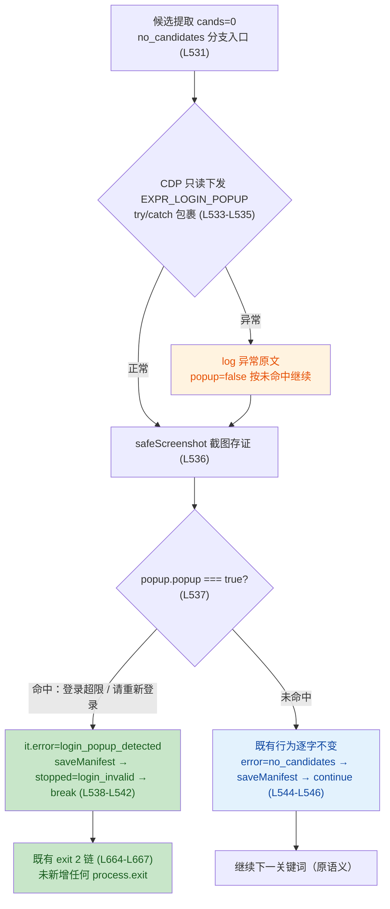

# LOGIN-DOM 技术审查报告（fm-reviewer → 主控代落盘）

> 审查：fm-reviewer｜日期：2026-09-13｜分支：feat/tp-06-menu-expansion｜HEAD=d138d9d（主控口径，本环境无 shell 未复验）
> **总判定：PASS WITH NOTES（通过·附注）——发现计数 0 C / 0 T / 1 S**
> 独立性声明：本报告为重派的独立复审，未参考、未推测任何前次报告结论；全部判断基于仓库文件本态、evidence 链与独立交叉验算。
> 方法学声明：审查环境无 shell，git diff/status 复算、node --check、pnpm 回归、CDP 探测、JSON.parse 复跑均无法执行（明确标注"未独立复跑"，移交 verify）；作为补偿，本次以**文件本态实读 + 全仓 Grep 引用面 + 截图实读 + 行号/字符级算术对账**完成部分独立验证。
>
> **主控落盘注记（2026-09-13）**：前次审查报告原文因主控会话上下文压缩丢失，按 T-C07 先例（报告原文丢失时不凭要点重构）重派本次独立复审，本文件即重派复审全文原样落档；前次报告不再追溯。重派复审的移交清单（V-1~V-6 / M-1~M-2）为 verify 与主控的唯一执行依据。

## 一、变更逻辑图（审查对象摘要）

## 二、R1~R7 逐项核验结果

### R1 EXPR_LOGIN_POPUP 表达式本体 [核对一致]

- 位置与结构：[batch-fetch.mjs:L327-L340](file:///d:/codex/family-menu/tools/content-pipeline/batch-fetch.mjs#L327-L340)，String.raw IIFE、体内 try/catch、返回 JSON.stringify(out)，与既有 [EXPR_CANDIDATES（L270-L325）](file:///d:/codex/family-menu/tools/content-pipeline/batch-fetch.mjs#L270-L325) 风格逐项一致。
- 信号仅两枚实锤文本：「登录超限」「请重新登录」（L336/L337），与 T-C06 截图实读结果吻合——本人已直接读取 [no-cand-17-1789248726547.png](file:///d:/codex/family-menu/.workflow-verify/tp-c04/no-cand-17-1789248726547.png)，弹窗明确含「电脑设备登录超限，请重新登录」蓝底文案 + 扫码/手机号登录面板，两枚 substring 均为该原句子串，无外推。
- 零 DOM 结构 selector：仅用 document.body.innerText（卡面明文许可的信号载体），无任何 class/selector 猜测。
- 注释完备：L327-L331 写明信号来源（截图路径 + T-C06-dev §2 原句）与局限声明（文案彻底改版则漏报、按 no-cand 截图人工介入），满足 AC1 注释要求。
- 误报面评估：侧边栏「登录」按钮等常见词不含两枚信号子串，不会误触发；探测点仅在候选 0 分支执行，正常态搜索页不受影响。

### R2 no_candidates 分支改造 [核对一致]

- 探测点位置：[batch-fetch.mjs:L531-L547](file:///d:/codex/family-menu/tools/content-pipeline/batch-fetch.mjs#L531-L547)，位于 `if (!v.ok || !v.cands || v.cands.length === 0)` 块内、2.5s 二次提取（L524-L528）之后，符合"唯一探测点"约束。
- try/catch 容错：L534-L535，探测异常仅 log 异常原文（e.message）并重置 popup=false 继续走未命中路径——探测基础设施故障不会改变原行为。
- safeScreenshot 保留：L536，位于命中判定之前，命中/未命中两路径均有截图存证。
- 命中路径：L538-L542，`it.status='failed'` / `it.error='login_popup_detected'` / saveManifest / log 带 signals / `stopped={reason:'login_invalid', at:i}` / break，随后走既有 [exit 2 链（L664-L667）](file:///d:/codex/family-menu/tools/content-pipeline/batch-fetch.mjs#L664-L667)，未新增任何 process.exit（全文件 process.exit 共 9 处，全部为既有）。
- 未命中路径逐字不变：L544-L546（failed/no_candidates/saveManifest/continue）在 dev 粘贴 hunk 中为上下文行，与文件本态一致。
- 细节核验：`popup && popup.popup === true` 判定对 JSON.parse 异常路径、undefined 返回值均安全（异常已被 catch 重置）；命中路径的 manifest 写入发生在 log/break 之前，进程中断也不丢记录；finally 块（L659-L661）二次 saveManifest 幂等无害。

### R3 既有逻辑零改动核验 [核对一致（内容级）]

- URL 级检测三处健在且内容未动：[L256](file:///d:/codex/family-menu/tools/content-pipeline/batch-fetch.mjs#L256)（recoverRenderer）、[L457](file:///d:/codex/family-menu/tools/content-pipeline/batch-fetch.mjs#L457)（about:blank 恢复）、[L485](file:///d:/codex/family-menu/tools/content-pipeline/batch-fetch.mjs#L485)（safeNav）。
- exit 2/3 链 [L664-L667](file:///d:/codex/family-menu/tools/content-pipeline/batch-fetch.mjs#L664-L667) 原样。
- KEYWORDS 实数 30 个（[L48-L58](file:///d:/codex/family-menu/tools/content-pipeline/batch-fetch.mjs#L48-L58)，本人逐词清点：荤 12 + 素 8 + 汤 5 + 主食 5）。
- BATCH_CONSEC_FAIL_STOP=4（[L42](file:///d:/codex/family-menu/tools/content-pipeline/batch-fetch.mjs#L42)）、MAX_CANDIDATES_PER_KEYWORD=12（[L39](file:///d:/codex/family-menu/tools/content-pipeline/batch-fetch.mjs#L39)）原样。
- git 层面"零 diff"无法在本环境证明（无 shell），已移交 verify 复核（V-5）。

### R4 头注释同步 [核对一致]

[L11-L12](file:///d:/codex/family-menu/tools/content-pipeline/batch-fetch.mjs#L11-L12)：「登录失效（URL 跳 /login 或页面内登录弹窗）立即 exit 2 不重试」+ LOGIN-DOM 日期来源注记（T-C06 实锤句），与 AC1 要求逐字对应；退出码表（L20）口径不变且与新行为自洽。

### R5 apply-ingredients.mjs [核对一致]

- 头注释 [L3](file:///d:/codex/family-menu/tools/content-pipeline/apply-ingredients.mjs#L3)、[L6](file:///d:/codex/family-menu/tools/content-pipeline/apply-ingredients.mjs#L6) 均为「30 道」口径。
- 逻辑值未动：[L69](file:///d:/codex/family-menu/tools/content-pipeline/apply-ingredients.mjs#L69) `draft.dishes.length !== 30`、[L119](file:///d:/codex/family-menu/tools/content-pipeline/apply-ingredients.mjs#L119) `manifestIds.length !== 30`，且 L70/L120 报错文案「应为 30」（T-C06 §15 既有改动）成对完好。
- 本人实读全文件：无「29 道」残留（L9「既有 19 道菜」为另一合法口径，未触碰）。与 2 ins/2 del 对账自洽（恰 L3/L6 两处 -1/+1）。

### R6 diff 对账 [对账自洽，含 1 处记录瑕疵 → S-1]

本审查对 dev 报告 §三 与文件本态做了三重算术对账：

1. **可见内容行**：头注释 2 ins/1 del + EXPR 块 14 ins + no_candidates 分支 11 ins = 27 ins/1 del，与 stat「28 ins/1 del」差 1。
2. **缺口归因**：EXPR 块与 buildDetailExpr 间现存两个空行（L326/L341），改前按代码风格必有一个空行 → 恰 1 行空行被插入 → 27+1=28 ins，**与 stat 完全吻合**。
3. **第二角度交叉印证**：dev 时间线 #1 记录改前 no_candidates 位于 L515-520，改后实测 L531，位移 +16 = 头注释净 +1 + EXPR 区 +15（14 内容行 + 1 空行），再次确认空行插入真实存在。

结论：**28/1、2/2、合计 30 ins/3 del 三个权威数字与文件本态完全自洽**；唯一瑕疵是 dev 报告 §三 的 EXPR hunk 粘贴少了 1 行空行 `+`（粘贴合计 27 与其自身 stat 28 差 1），属记录层面不完整，非代码问题 → 记 S-1。

### R7 边界合规 [核对一致（内容级）]

- xhs-fetch.mjs 零触碰：[L335](file:///d:/codex/family-menu/tools/content-pipeline/xhs-fetch.mjs#L335)/[L389](file:///d:/codex/family-menu/tools/content-pipeline/xhs-fetch.mjs#L389) 仍为 URL-only 检测，全文件无 EXPR_LOGIN_POPUP/login_popup 字样——同构缺陷保持"备案不改"口径。
- drift-check.mjs 本体零触碰：[tc06-drift-check.mjs:L50-L56](file:///d:/codex/family-menu/tools/content-pipeline/out/xhs/tc06-drift-check.mjs#L50-L56) 仍只 console.log（含 `DRIFT CHECK PASSED: 29/29 unchanged, 1 added` 文本），不写文件——与任务卡"脚本本体无 bug 不动"一致，也反证 JSON 污染成因（PowerShell stdout 捕获）备案属实。
- fetch2dish.mjs、src/cli/import.ts 存在性确认（Glob），内容级抽查无本卡痕迹；git 层面精确零 diff 移交 verify（V-5）。
- 全仓 Grep 引用面：EXPR_LOGIN_POPUP/login_popup_detected 仅出现于 batch-fetch.mjs（定义 L332、使用 L534/L538）与 evidence 文档，未泄漏至任何其他运行时文件，**batch-manifest.json 无 login_popup_detected 残留**（manifest 既有数据零触碰的内容级佐证）。
- 物证链缺口备案如实：dev 报告 §五.1 明确记载 mock/CDP 验证脚本位于 %TEMP% 已删除，并附主控裁决注记（verify 自建等价脚本补齐、物证落 .workflow-verify/login-dom/）——备案完整无隐瞒。

## 三、AC 对照表

| AC | 判定 | 一句话依据 |
|---|---|---|
| AC1 探测落地 | [✓] | 表达式（L327-L340）+ 分支改造（L531-L547）全部落地，唯一探测点/try-catch 按未命中继续/未命中路径逐字不变/走既有 exit 2 链/注释来源与局限声明逐项符合卡面 |
| AC2 头注释 29→30 | [✓] | apply-ingredients.mjs L3/L6 均 30 道，本人实读全文件无「29 道」残留 |
| AC3 tc06-drift-check.json 尾行剥离 | [✓] | 按 2026-09-13 主控裁决③口径（本地文件合法即完成）：实读 221 行、末行为 `}`，无任何非 JSON 文本行；结构与 T-C06 §10 数字（29/0/1、行账 10/10/107/107）完全吻合 |
| AC4 验证真实性 | [✓*] | 证据链可信：mock 三向结论可由表达式静态逻辑独立推演复现，EXPR_LEN=381 经本人逐字符计数精确吻合（强佐证 mock 提取的即文件内真实表达式）；node --check、CDP 负向、回归 19/442 为执行类证据未能独立复跑，移交 verify（V-2/V-3/V-4） |
| AC5 git 边界（修订口径 M 恰 2） | [✓*] | 内容级证据与 M 恰 2 一致：卡片相关改动仅见于两文件、边界对象抽查零变化、.gitignore:29 确认 out/ 整目录忽略（tc06-drift-check.json 不入库口径成立）；git status 精确复核移交 verify（V-5） |

AC4 关键交叉验证说明：dev 报告 §四.1 称 mock 脚本用正则从 batch-fetch.mjs 源码提取真实表达式且 EXPR_LEN=381。本人对文件内 [L332-L340](file:///d:/codex/family-menu/tools/content-pipeline/batch-fetch.mjs#L332-L340) 模板字面量逐字符计数（含换行，9 行，末行 `})()` 无尾随换行）结果恰为 381——该数字无法从 dev 报告文本推得（报告中并未写明逐行长度），构成独立于 dev 叙述的强佐证。反向样例（「请使用扫码登录」不含「请重新登录」子串、NEG1 文本不含两信号）经静态逻辑推演均正确返回 popup:false。

## 四、发现清单（0 C / 0 T / 1 S）

| 编号 | 位置 | 问题 | 建议 |
|---|---|---|---|
| S-1 | [LOGIN-DOM-dev-2026-09-13.md §三](file:///d:/codex/family-menu/evidence/LOGIN-DOM-dev-2026-09-13.md) | EXPR_LOGIN_POPUP hunk 粘贴不完整：缺块间 1 行空行 `+`，粘贴合计 27 ins 与其自身粘贴的 stat（28 ins/1 del）差 1；经文件本态三重算术对账（见 R6），**权威数字本身正确**，仅记录不完整 | 不阻塞。主控提交时以实测 git diff --stat 为最终对账依据（M-1）；如追求记录完备可在 dev 报告补一行粘贴勘误注记，非必须 |

## 五、未验证项（本环境无 shell，明确标注）

1. `node --check` EXIT=0 —— 未独立复跑（静态旁证：本人实读全文件无语法异常结构，String.raw 模板/反引号配对完好）。
2. mock 正反三向实跑输出 —— 未独立复跑（已由 EXPR_LEN=381 + 静态逻辑推演替代覆盖，物证脚本在 %TEMP% 已删除）。
3. 真实 CDP 负向探测 popup=false —— 未独立复跑（且本审查亦受红线约束不触碰 9222）。
4. 回归 `pnpm --filter @family-menu/content-pipeline test` 19 files/442 tests 全绿 —— 未独立复跑（test script 为 `vitest run --root ../..` 已经 [package.json:L24](file:///d:/codex/family-menu/tools/content-pipeline/package.json#L24) 证实，19/442 相对 T-C06 基线 15/391 的增量与本分支其他卡片加测试的口径自洽，但增量归因未逐项核实）。
5. `git status --porcelain` M 恰 2 文件、禁区零 diff —— 未独立复跑（内容级抽查已覆盖，git 层面移交 verify）。
6. tc06-drift-check.json 的 `JSON.parse` 实跑 —— 未独立复跑（文件本态实读已确认无尾行污染、结构平衡，实跑确认作为 V-6 低成本收口）。
7. 真实登录弹窗场景正向 CDP 实跑与 exit 2 全链路端到端 —— dev 已如实备案未做（红线禁止人为制造登录失效），任务卡 AC4 本就只要求负向；实现与既有 nav1 停止路径（L518）同构，静态审读无阻断项。

## 六、移交清单

**移交 verify（复跑项，物证一律落 .workflow-verify/login-dom/）**

| 编号 | 复跑项 | 预期 |
|---|---|---|
| V-1 | 自建等价 mock 脚本（从 batch-fetch.mjs 正则提取表达式 + new Function 注入 mock document），正向 + 反向 1（常见词）+ 反向 2（请使用扫码登录）三向 | POSITIVE popup:true 且 signals 恰两枚；NEG1/NEG2 popup:false；脚本与输出落 .workflow-verify/login-dom/ |
| V-2 | `node --check tools/content-pipeline/batch-fetch.mjs` | EXIT=0 |
| V-3 | `pnpm --filter @family-menu/content-pipeline test` | 19 files / 442 tests 全绿 0 failed，EXIT=0；输出落 .workflow-verify/login-dom/ |
| V-4 | 真实 CDP 只读负向探测（9222 在线时；不可达则降级备案） | popup=false signals=[]；全程仅只读 /json + Runtime.evaluate，红线同卡 |
| V-5 | `git status --porcelain` + `git diff --stat` | M 恰 2 文件（batch-fetch.mjs、apply-ingredients.mjs），numstat 28/1 与 2/2；禁区（packages/shared、packages/engine、apps/api/**、xhs-fetch.mjs、fetch2dish、import、drift-check.mjs 本体）零 diff |
| V-6 | `node -e "JSON.parse(...tc06-drift-check.json...)"` | EXIT=0，preFetchedDishCount=29 / postFetchedDishCount=30 |

**移交主控（提交/勘误项）**

| 编号 | 事项 |
|---|---|
| M-1 | 提交前以实测 `git diff --stat`/`--numstat` 做最终对账（预期 batch-fetch.mjs 28/1、apply-ingredients.mjs 2/2）；S-1 的 hunk 粘贴瑕疵以实测数字为准，如需可在 dev 报告补勘误注记 |
| M-2 | 保持既有挂账：xhs-fetch.mjs 同构缺陷（任务卡 §一.2 备案）不在本卡范围，勿遗失于队列 |

## 七、结论

- **判定：PASS WITH NOTES（对应流程 12.5 口径：通过·附注）**。
- 核心改动（EXPR_LOGIN_POPUP + no_candidates 分支探测 + exit 2 链复用）实现正确、边界克制、容错完备；未命中路径保持原语义逐字不变，回归风险面收敛于"候选 0"场景；搭车两项目标达成且零越界。
- 全部发现为记录/物证链层面（1 S），无正确性、无测试真实性缺陷；执行类验证项已按裁决口径成体系移交 verify 补齐物证链。
- 本报告为只读审查产物，未修改任何文件、未执行任何有副作用操作。

---

**审查依据文件一览**：[任务卡](file:///d:/codex/family-menu/evidence/LOGIN-DOM-task-2026-09-13.md)、[dev 报告](file:///d:/codex/family-menu/evidence/LOGIN-DOM-dev-2026-09-13.md)、[T-C06-dev](file:///d:/codex/family-menu/evidence/T-C06-dev-2026-09-13.md)、[T-C06-review](file:///d:/codex/family-menu/evidence/T-C06-review-2026-09-13.md)、[batch-fetch.mjs](file:///d:/codex/family-menu/tools/content-pipeline/batch-fetch.mjs)、[apply-ingredients.mjs](file:///d:/codex/family-menu/tools/content-pipeline/apply-ingredients.mjs)、[tc06-drift-check.json](file:///d:/codex/family-menu/tools/content-pipeline/out/xhs/tc06-drift-check.json)、[tc06-drift-check.mjs](file:///d:/codex/family-menu/tools/content-pipeline/out/xhs/tc06-drift-check.mjs)、[xhs-fetch.mjs](file:///d:/codex/family-menu/tools/content-pipeline/xhs-fetch.mjs)、[package.json](file:///d:/codex/family-menu/tools/content-pipeline/package.json)、[.gitignore](file:///d:/codex/family-menu/.gitignore)、[截图证据](file:///d:/codex/family-menu/.workflow-verify/tp-c04/no-cand-17-1789248726547.png)。
