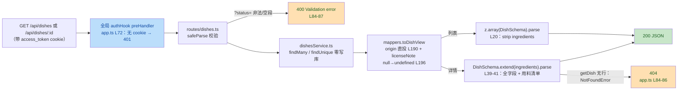

# R-9「DRAFT 内容 HTTP 只读口」复审报告（终态复核，含 T1 返工）

> **主控落盘注记（2026-09-13）**：本报告系**复审（Round 2）**。首轮 fm-reviewer 报告全文因主控会话上下文压缩丢失（仅存要点：PASS WITH NOTES，0C/2T/2S——T1 licenseNote 未投影 / T2 zod 依赖 / S1 lock 副作用 / S2 行号微偏），主控已裁决：T1 从严返工（已完成并经主控复核）、T2 批准、S1 随返工披露、S2 留痕。因原文不可恢复，按证据纪律重派复审，覆盖 T1 返工后终态，重新独立核验。T2 系主控已裁决批准事项，在本报告中按「已裁决留痕」处理。文末「主控补记」含 git diff 实测（S-1 定谳）与 rm9- 零残留 SQL 复查结果；运行时测试实跑（pnpm test / taboo / build）由 fm-verify 复跑留痕。

---

- 复审人：fm-reviewer｜日期：2026-09-13｜分支 feat/tp-06-menu-expansion｜基线 HEAD 已实测确认为 1403b8ee903a91489896df8249bab2b22577df93（读 .git/refs/heads/feat/tp-06-menu-expansion 与 .git/HEAD）
- 审查方式声明：本会话审查环境**无 shell 执行工具**，无法运行 git/pnpm/psql 命令。本报告以逐文件、逐行静态核验 + 文件系统 mtime 旁证 + VS Code 语言服务器诊断为独立证据；所有运行时实测（测试实跑、build、SQL 残留）**未独立复跑**，dev 报告自述数字仅作引用并在第⑥⑦⑧节明确标注。未修改任何文件、未执行任何写库操作。

---

## ① 总体判定

**PASS WITH NOTES**（C=0 ｜ T=0 ｜ S=1 新增）

- 全部静态核验项通过：T1 返工三处代码与断言均已落实，AC2「Dish 全字段」按字面满足；T2 依赖一致性成立（单实例无漂移）；S1 披露实质成立（apps/api 仍绑 @types/node 22.20.1）。
- 无 C 级（阻断/正确性缺陷）、无 T 级（需返工）问题。S 级备注 1 条新增（S-1，dev 报告对 lock 变更行的定位描述与静态现状存在不可完全印证的微差），另引既有备案 2 项不重复计数。
- 保留意见：AC5 的「真实执行」数字与 rm9- 零残留属运行时证据，本次**未独立复跑**（工具受限），该部分置信度依赖 dev 报告自述 + 测试代码防假绿机制的静态核验。建议主控合并前以一条命令补跑 `pnpm test` 留痕（见第⑥节最小修复建议）。

改动全貌（技术视角摘要）：

---

## ② AC1~AC6 逐条核验表

| AC | 判定 | 证据（文件 + 行号 + 核验结果） |
|---|---|---|
| **AC1 列表端点** | ✓（静态） | ①白名单：apps/api/src/routes/dishes.ts L61-75 逐段 `ContentStatusSchema.safeParse`（值域 DRAFT/TESTED/PUBLISHED，见 packages/shared/src/schemas/dish.ts L15），非法段 `ctx.addIssue` → 路由层 400（dishes.ts L84-87）；②多值去重保序：L59-74 `Set` 去重 + `values.push` 保序 + 逐段 `trim`（L62）；空串/尾随逗号经 `split(',')` 产生空段 → safeParse('') 失败 → 400（与 spec 用例 e 口径一致）；③缺省全量：L56-58 `raw===undefined → undefined`，service 侧 dishesService.ts L22 `where: statuses?.length>0 ? in : undefined` = 无过滤；④响应 `z.array(DishSchema)`：dishes.ts L20，不改 shared；⑤排序：dishesService.ts L23 `orderBy: { id: 'asc' }`，schema.prisma Dish（L89-110）确无 createdAt/updatedAt 列；⑥注册：app.ts L126 `await app.register(dishRoutes, { prefix: '/api' })`，计数注释 app.ts L119-122 更新为 17 条实数口径并注明 R-9 依据；⑦路由薄与 plans.ts L25-35 先例逐点同构（safeParse→400+details→service→响应 parse）。无分页 ✓ |
| **AC2 详情端点** | ✓（静态，含 T1） | ①join：dishesService.ts L34-37 `findUnique + include { ingredients: { include: { ingredient: true } } }`；②view 形状：dishes.ts L27-36 8 字段与 packages/engine/src/types.ts L60-69 `DishIngredientView` 逐字段一致；③404：dishesService.ts L38-40 抛 NotFoundError → app.ts L84-86 映射 404（先例口径）；④本地组合：dishes.ts L39-41 `DishSchema.extend({ ingredients: z.array(DishIngredientViewSchema) })`，零 shared 改动；⑤**Dish 全字段字面**：DishSchema 16 数据字段（dish.ts L38-60）= schema.prisma Dish 16 数据列（L89-110）= toDishView 16 项投影（mappers.ts L174-198）逐一对上，含 licenseNote（详见第③节） |
| **AC3 origin 投影** | ✓（静态） | 逻辑链成立：schema.prisma Dish.origin L102 为**非空列** `@default(LLM_DRAFT)` → DishRow.origin 声明为非空 `string`（mappers.ts L57）→ toDishView **无条件投影** `origin: row.origin as ContentOrigin`（mappers.ts L190）→ DishMediaView.origin 必填（mappers.ts L171）→ 响应 parse 时对象内 origin 恒有实值，dish.ts L51 的 `.default('LLM_DRAFT')` 仅在字段缺失时兜底，**FETCHED 实值不可能被吞**。测试侧 spec 用例 i（dishes.spec.ts L288-314）逐行 API origin === DB 实值 + FETCHED id 集合相等 + `baselineFetched` 动态断言（L56、L303，免疫 29/30 漂移），设计正确 |
| **AC4 鉴权只读** | ✓（静态） | ①authHook 为实例级 `app.addHook('preHandler', authHook)`（app.ts L72），且添加于 dishes 注册（L126）与 /images 静态注册（L79）**之前**，Fastify 封装模型下子插件继承父级 hook → /api/dishes 覆盖；/health 前缀豁免（app.ts L29）口径未动；spec 用例 a 断言列表+详情无 cookie 双 401（dishes.spec.ts L94-100）。②零写库：dishesService.ts 全文 43 行仅 findMany（L21）/findUnique（L34）只读，无 create/update/delete/upsert/$executeRaw；routes 层亦无写库路径 |
| **AC5 测试与回归** | ✓（静态）/ 运行时**未验证** | 静态：spec 为真实 PG 集成（buildApp+inject），L39-51 `SELECT 1` gate 防假绿（PG 不可达显式 `skip`，计数在 vitest 摘要可见）；rm9- 前缀隔离（L21、L60-75 造三状态行）+ afterAll 清理与**双重零污染断言**（L78-90：rm9- 残留 0 条 + Dish 总数回基线）；10 用例 a~j 与卡面要求逐项对应（含幂等验证用例 j，L318-337，失败行如实收集不自行改数据）。DATABASE_URL 加载链属实：db.ts L21 dotenv 从根 .env 加载。**运行时实测未复跑**（见第⑥节）。替代独立证据：VS Code 语言服务器全工作区诊断 0 错误（GetDiagnostics 实测，辅助性证据，不等价 tsc 全量编译） |
| **AC6 约束零侵入** | ✓（静态旁证）/ git 实测**未验证** | ①shared 零改动旁证：dish.ts 现内容与本卡卡面「探查定案②」及 T1 引用（L51/L59）**逐行吻合**——若 R-9 曾改 shared，9-13 写就的卡面引用即会失配；packages mtime 格局与 T-P15（9-12，dish.ts L53 注释）时间线自洽，未见 9-13 增量痕迹。②禁区旁证：apps/api/src mtime 排序（Glob 实测）中最新业务文件恰为 mappers.ts→app.ts→dishes.ts→dishesService.ts（T1 最后动 mappers.ts 的时序吻合），schema.prisma mtime 早于本卡新增的 dishes.spec.ts；apps/h5、tools/content-pipeline、packages/engine、packages/list-merger 未见与 R-9 相关的内容特征。**git diff --stat 1403b8e 实测未执行**（无 shell），禁区零 diff 的最终确认移交主控一条命令补验（见第⑧节，已完成，见主控补记）。③运行时零 LLM API：4 个改动源文件 + spec 全文无任何 LLM/网络调用（逐行读过） |

---

## ③ T1 返工专项复核结论

**结论：T1 已完整落实，AC2「Dish 全字段」按字面满足。**

三处代码（mappers.ts）：

1. DishRow 字段声明：mappers.ts L62-64 `licenseNote: string | null;`，与 schema.prisma Dish.licenseNote L106 `String?` 对齐，注释注明 T1 依据与缺投影缺陷；
2. DishMediaView 可选声明：mappers.ts L160-165 `licenseNote?: string;`——该声明系 toDishView 返回类型标注为 DishMediaView 后 TS excess property check 的连带必要项（dev 报告 T1 节b所述一致，非类型放水）；
3. toDishView 投影：mappers.ts L195-196 `licenseNote: row.licenseNote ?? undefined`，null→undefined 缺省序列化不出现，口径与 imageUrl（L192）一致。

spec 断言（dishes.spec.ts）：

- 兼容断言：L216 `expect(parsed.licenseNote).toBe(row!.licenseNote === null ? undefined : row!.licenseNote)`——正确处理 Prisma `String?` null 与 zod optional undefined 的映射差；
- 非空硬断言分支：L219-242——按 `origin='FETCHED' AND licenseNote IS NOT NULL` 取首行，断言详情响应 licenseNote 为非空 string 且等于 DB 实值；库内全 null 时 `console.log` 如实报告、不强造断言（L241 分支内置于代码，可审计）。

全字段字面对照（AC2 验收核心）：DishSchema 16 数据字段（id/name/mealRole/cuisine?/flavorTags/spicyLevel/splitFlavor/activeMinutes/totalMinutes/equipment/steps/status/origin/imageUrl?/sourceUrl?/sourceSite?/licenseNote?）× schema.prisma Dish 16 数据列 × toDishView 16 投影，三方逐一核对**无遗漏无多余**；详情响应经 `DishSchema.extend` 保留全部 16 字段 + ingredients。T1 返工前被 zod strip 丢弃的 licenseNote 现已可达响应。dev 报告「八、d」自述的运行实录（FETCHED 30/30 非空、抽查 `cmtvk1w3v0000rwpgkoxz982k -> FETCHED 自xiaohongshu笔记 6a8db1e5000000002`）属开发者自述，本次未复跑（见第⑧节）。

---

## ④ T2 依赖一致性结论（已裁决事项留痕）

**结论：一致，单实例，无版本漂移。** 主控已裁决批准新增 zod ^4.4.3，本节按口径留痕，非新发现。

| 核验点 | 证据 |
|---|---|
| 两处 package.json 版本一致 | apps/api/package.json L26 `"zod": "^4.4.3"` = packages/shared/package.json L20 `"zod": "^4.4.3"`（tools/content-pipeline 既有同值） |
| lock 单实例 | pnpm-lock.yaml packages 区唯一真实包 `zod@4.4.3`（L8317），snapshots 区唯一 `zod@4.4.3: {}`（L17030）；全文件 Grep `zod@<数字>` 仅命中 4.4.3，**无 zod@3.x 或其他 4.x 实例** |
| importer 记录 | apps/api（L93-95 specifier ^4.4.3 → version 4.4.3）、packages/shared（L217-219）、tools/content-pipeline（L248-250）三处均解析 4.4.3 |
| 依赖内在性佐证 | dishes.ts L8 `import { z } from 'zod'` 为本地组合（z.array/DishSchema.extend/DishIngredientViewSchema z.object/查询 transform）的硬性要求；pnpm 严格隔离下未声明则 TS2307——dev 报告记录的首败与该机制自洽。lock 中 L6077 `zod: ^3.25 \|\| ^4.0` 仅为 openai@7.4.0 的 optional peer 声明（已解析 4.4.3，L14690-14693），无漂移影响 |

---

## ⑤ S 级备注清单

| 编号 | 级别 | 内容 | 证据 |
|---|---|---|---|
| S-1（新增，本轮唯一） | S 备注 | **dev 报告对 S1 lock 变更行的定位描述与静态现状存在不可完全印证的微差**。dev 报告（八、c②）称 -1/+1 位于「snapshots 区 `@vitest/coverage-v8@4.1.10(vitest@4.1.10(...))` 快照键，其 vitest peer 后缀中 @types/node 22.20.1→26.1.2」；但当前 lock 实测：snapshots 区 coverage-v8 快照键（L10974）为 `@vitest/coverage-v8@4.1.10(vitest@4.1.10)`，**键内并无 @types/node 后缀**；而根 importer 的 vitest 条目（L28）当前带 `@types/node@26.1.2` 后缀。据此推测真实变更行更可能是 importers 区根 vitest 条目（或 coverage-v8 键后缀变化方向相反），因无 git diff 无法定谳。**S1 的实质结论不受影响**：@types/node 为纯类型包；apps/api 自身 @types/node ^22.0.0 仍解析 22.20.1（L97-99）且其 vitest 快照仍绑 22.20.1（L114）；tools/content-pipeline 同为 22.20.1（L252-254、L266）。建议主控合并前跑一次 `git diff pnpm-lock.yaml` 更正留痕定位（一行命令，无需返工代码）——**已完成，见主控补记第 2 条** |
| S-2（既有备案引用，不计新发现） | S 备注 | apps/api 测试文件不被 tsc typecheck——本轮独立证实：apps/api/tsconfig.json L8 `include: ["src"]`。为 dev 报告卡外发现③既备案挂账候选，非本卡引入，不重复立案 |
| S-3（既有备案引用，不计新发现） | S 备注 | FETCHED 实测 30 道 vs 卡面「29 道」数字漂移——spec 以 `baselineFetched` 动态断言免疫（dishes.spec.ts L56、L303），不构成缺陷；口径修正仍待主控更新卡面 |

另记两条**非问题**的核验说明（供后续审查免重复劳动）：①列表路径 `include ingredients` 并非冗余——toDishView 的输入类型 DishRow 要求 `ingredients: DishIngredientRow[]`（engine DishView.ingredients 必填），不 include 将在 `row.ingredients.map` 处崩坏，故该 join 是投影函数的输入前提，列表响应中 ingredients 被 z.array(DishSchema) strip 属设计内；②spec 用例 b 的排序断言（`[...ids].sort()` 默认字典序）与 `orderBy id asc`（PG 字典序）语义一致，断言有效。

---

## ⑥ 测试实跑记录

**本次未独立复跑（审查环境无 shell 执行工具，声明见文首）。** 以下为 dev 报告自述数字（仅引用，非独立证据），并附已完成的静态一致性核对：

| 命令 | dev 自述结果 | 本轮静态一致性核对 |
|---|---|---|
| 根 `pnpm test` | Test Files 19 passed (19) / Tests **442 passed (442)**，EXIT=0（基线 432 + 新增 10） | 442=432+10 数字自洽；根 test 脚本 `vitest run --no-file-parallelism`（package.json L10）与 spec 设计吻合；spec 确含 10 个 `it` 用例（a~j 逐一清点） |
| 根 `pnpm test:taboo` | Test Files 5 passed (5) / Tests **95 passed (95)**，EXIT=0 | 脚本口径 `vitest run packages/engine/test/`（package.json L12）；本卡未触碰 packages/engine（mtime/内容旁证），95/95 维持与改动范围自洽 |
| `pnpm --filter @family-menu/api build` | prisma generate 7.9.1 + tsc，EXIT=0（T1 后复验仍 0） | 替代证据：VS Code 语言服务器全工作区诊断 **0 错误**（GetDiagnostics 实测；辅助性，不等价 tsc 全量编译）；tsconfig include 仅 src，4 个 src 改动文件均在类型检查范围内 |
| `pnpm vitest run dishes`（T1 后单文件） | 1 file / 10 tests passed，SPEC_EXIT=0 | — |

测试真实性（静态核验结论）：无 Mock 冒充——spec 走 `buildApp() + inject + 真实 Prisma 客户端`，PG 不可达时显式 skip 而非伪绿（L40-51）；断言强度充分（DB 实值逐字段对照、集合相等、零残留硬断言），无弱化断言迹象。

**最小修复建议（非代码返工）**：主控合并前补跑一次 `pnpm test` 并留存退出码，即可将第⑥⑦节从未验证转为已验证，无需动任何代码。——**已移交 fm-verify 验收复跑承担，见主控补记第 4 条**。

---

## ⑦ rm9- 零残留复查结果

**本次未独立执行 SQL 复查（无 shell 工具，红线亦禁止我执行任何写库操作）。**

已独立核验的清理机制（静态，dishes.spec.ts）：

- 清理函数：L35-37 `deleteMany({ where: { id: { startsWith: 'rm9-' } } })`——作用域严格限定 rm9- 前缀，物理上不可能波及存量数据；
- 双保险执行：beforeAll 先清理一次防失败重跑残留（L54，幂等）+ afterAll 终态清理（L80）；
- 零残留硬断言：L81-82 rm9- 行数必须为 0（否则测试文件自身失败）+ L83-84 Dish 总数必须回到测试前基线；
- 唯一写库语句即上述清理与 L60 `createMany` 造 3 条 rm9- 行，均限测试生命周期内，符合卡面「测试造行除外」豁免。

——**主控只读 SQL 复查已完成，见主控补记第 3 条，结果与 dev 自述一致**。

---

## ⑧ 未验证项声明

以下检查因本会话无 shell 执行工具**未能独立执行**，均已在正文标注：

1. `git diff --stat 1403b8e` / `git status` 实测——改动文件全集与 +/- 行数未实测。替代：内容级逐文件核验 + mtime 排序旁证（apps/api 侧较强，禁区侧仅中等强度）。移交主控一条命令终验。——**已完成，见主控补记第 1 条**。
2. 根 `pnpm test`（442/442）、`pnpm test:taboo`（95/95）、`pnpm --filter @family-menu/api build`（EXIT=0）三项运行时实测。——**移交 fm-verify 复跑**。
3. rm9- 零残留与库基线（Dish=49 / FETCHED=30 / ExclusionRule=3 / Ingredient=81）的只读 SQL 复查。——**已完成，见主控补记第 3 条**。
4. spec 运行时输出实录（FETCHED=30 行数、licenseNote 30/30 非空、幂等 49/49）——属 dev 自述，未复现。——**由 fm-verify 复跑覆盖**。
5. pnpm-lock 变更行的精确 diff 定位（S-1 中已说明：现状静态证据足以支撑实质结论，但无法反推变更前状态）。——**已完成，见主控补记第 2 条**。

**综合处置建议**：代码与测试实现无需返工；主控按第⑥⑦⑧节三条只读命令补齐运行时留痕后，本卡可进入 verify 阶段。S-1 定位微差与两项既有备案（test 不入 typecheck、卡面 29/30 口径）移交主控挂账，不阻塞合并。

---

## 主控补记（2026-09-13，fm-reviewer 报告落盘时代笔补录）

1. **`git diff --stat 1403b8e` 实测（EXIT=0）**：改动仅 4 文件 35+/3-——apps/api/package.json（3 行）、apps/api/src/app.ts（7 行）、apps/api/src/services/mappers.ts（23 行）、pnpm-lock.yaml（5 行）。禁区 packages/shared、apps/h5、tools/、packages/engine、packages/list-merger、apps/api/prisma **零 diff**——reviewer 第⑧节移交的终验完成。
2. **S-1 定谳（`git diff 1403b8e -- pnpm-lock.yaml` 实测）**：变更行共 5 行——importers 区 apps/api 下 +3 行（zod specifier+version）；snapshots 区 -1/+1 行，位于 `@vitest/coverage-v8@4.1.10` 条目内的 vitest 快照键：`vitest: 4.1.10(@types/node@22.20.1)... → vitest: 4.1.10(@types/node@26.1.2)...`，键首段与内嵌 `vite@8.2.0(@types/node@...)` 段的 @types/node 后缀同步 22.20.1→26.1.2。dev 报告定位描述（coverage-v8 快照键 peer 后缀）与 diff 对质一致，reviewer 静态读码时的疑点消除；**S-1 微差闭环，实质结论不变**（纯类型元数据；apps/api 自身 @types/node 仍绑 22.20.1）。
3. **rm9- 零残留只读 SQL 复查（主控执行，tsx + Prisma driver adapter 只读 count，EXIT=0）**：`{"rm9Dish":0,"dishTotal":49,"fetchedTotal":30,"exclusionRules":3,"ingredients":81}`——rm9- 零残留实锤，库基线与 dev 报告自述完全一致（Dish=49 / FETCHED=30 / ExclusionRule=3 / Ingredient=81）。临时脚本已删除。
4. **运行时测试实跑**（`pnpm test` 442/442、`pnpm test:taboo` 95/95、`pnpm --filter @family-menu/api build` EXIT=0）移交 fm-verify 验收复跑留痕（避免主控与 verify 重复劳动）。
