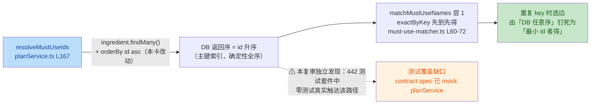

# S-3 技术审查报告：planService.ts L167 防御性排序（重派独立复审）

> 本报告为重派的独立复审：不依赖、不引用任何历史复审结论，全部证据从零独立核查取得。
> （主控落盘注记：首轮 fm-reviewer 复审报告全文因主控上下文丢失只剩要点，按 T-C07 先例不凭要点重构，重派独立复审；本报告即重派复审原文，主控逐字落盘未改。）

## 一、元信息

| 项 | 值 |
|---|---|
| 执行角色 | fm-reviewer（技术审查，工具级只读，未修改任何文件） |
| 复审日期 | 2026-09-13 |
| 分支 / HEAD | feat/tp-06-menu-expansion @ ab6af0d（本卡改动未提交，待收口统一提交） |
| 任务卡 | evidence/S-3-task-2026-09-13.md |
| dev 报告 | evidence/S-3-dev-2026-09-13.md |
| 审查对象 | planService.ts:167 单行改动：`prisma.ingredient.findMany()` → `prisma.ingredient.findMany({ orderBy: { id: 'asc' } })` |
| 工具限制（如实注明） | 本环境无 shell/git 工具：git 层终验（改动面 1 文件 1 行、禁区零 diff、HEAD=ab6af0d）依赖主控移交项 1~5 交叉引用，未能独立亲验；测试复跑（442/442、95/95、build EXIT=0）未能独立执行，以 dev 双轮实测 + 主控基线交叉、fm-verify 终验为准。文件侧全部以 Read/Grep/Glob 独立核查 |
| 判定 | **FAIL**（代码层正确、无需返工；打回对象为 dev 报告两处失实证据描述 + AC5 实证缺口的主控知情裁量。详见第五节） |

## 二、改动概览

**意图归纳**：防御性排序核销 DUP-KEY-review S-3 挂账——PG 无 ORDER BY 返回序不保证，matcher 层 1「先到先得」（must-use-matcher.ts:60-72，`if (!exactByKey.has(normalized))` 守护）的「先到」在 DB 任意序下无定义；加 orderBy 将其确定性化。

## 三、R1~R6 逐条核查

### R1 改动与卡面 AC1 一致（恰 1 文件 1 行）——✓

- **核查方式**：planService.ts 终态 Read 逐行核对 + 主控移交项 2/3 交叉。
- **证据**：planService.ts:167 终态为 `const ingredients = await prisma.ingredient.findMany({ orderBy: { id: 'asc' } });`，与卡面 AC 改动描述及 dev 报告第 1 节 diff 摘录（`@@ -164,7 +164,7 @@` 恰 1 hunk）逐字一致。主控移交 2/3 实测 `1 file changed, 1 insertion(+), 1 deletion(-)`，与 dev 报告第 3 节 numstat `1 1 planService.ts` 三方一致。

### R2 边界约束遵守（禁改文件零触碰）——✓（git 层为主控移交交叉，未能独立亲验）

- **核查方式**：文件侧独立核查禁区文件现状 + 主控移交 1/4 交叉。
- **证据**：
  1. must-use-matcher.ts 终态全文 Read：内容为 TP-05 方案 E 纯函数原貌（L60-72 层 1 字典、L87-114 层 2），无本卡痕迹；
  2. planService.ts 其余 findMany 现状与卡面备案逐点吻合（见 R5）；
  3. 约束 3（无 DB 写操作）：改动为只读查询加排序，代码层成立；
  4. 约束 4（无测试改动）：dev 报告第 6 节 git status 仅 planService.ts 一处 M，与主控移交 1 一致；
  5. packages/shared、packages/engine 零 diff：依赖主控移交 4（空输出）+ dev 报告第 3 节，两个独立来源陈述一致，但本复审无 git 能力未能独立亲验，**如实注明**。

### R3 改动技术正确性——✓

- **核查方式**：Prisma 版本与语法先例核查 + matcher 语义逐层推演。
- **证据**：
  1. **语法有效**：Prisma ^7.7.0（apps/api/package.json L20-21、L31，driver adapter @prisma/adapter-pg ^7.7.0）。`orderBy: { id: 'asc' }` 是 FindManyArgs 标准对象语法，且库内已有同款先例在产线运行：dishesService.ts:23（R-9）。tsc 类型层面若 orderBy 形状非法会编译失败，build EXIT=0（dev 双轮 + 主控基线）佐证类型有效；
  2. **语义正确**：must-use-matcher.ts:61-72 层 1 字典构建按 candidates 数组序「先到先得」占坑；本卡使 candidates 序 = DB id 升序，重复 key 选边从「DB 任意序」变为「最小 id 者得」，确定性成立；
  3. **层 2 天然序无关**（本复审独立验证的加分项）：must-use-matcher.ts:89-98 层 2 命中集 `hitIds` 为按食材 id 去重的 Set，采纳条件 `size === 1` 与遍历序无关，歧义（≥2）时一律透传——即本卡 orderBy 只钉死层 1 唯一序敏感点，与 AC4「DB 侧确定性化不改变算法」的卡面声明一致；
  4. **性能无虞**：id 为主键（schema.prisma:69 `@id @default(cuid())`），主键索引下 ORDER BY id ASC 走索引序，无额外排序成本。

### R4 与 dev 报告陈述无矛盾——✗（本复审核心发现）

- **核查方式**：dev 报告 5/5 [✓] 与主控移交交叉后，对其证据叙述逐句与测试文件事实比对。
- **交叉一致部分**：AC1/AC4 与移交 1~4 一致；AC2/AC3 数字（442/442、95/95、build EXIT=0）与移交 6 基线一致（本复审未复跑，待 verify 终验）；matcher.spec 17 个 it、contract.spec 53 个 it 的计数经 Grep 独立证实。
- **矛盾部分**：dev 报告对 contract.spec 的性质描述**与文件事实直接矛盾**：
  1. dev 报告 2.2 节（L54）称「contract.spec.ts 53 tests（**真实 PG + 真实 Fastify HTTP 全链路**……）」——事实：contract.spec.ts:22 以文件级 `vi.mock('../src/services/planService.js')` 将 planService 全量替换为 vi.fn()（L49 `generateRecommendation: vi.fn()`），文件头 L3 自述「**本机无 PG，mock planService 避免 DB 操作**」。全文件无 doUnmock/importActual/prisma 引用（Grep 0 命中）。contract.spec 是 mock 契约测试，**不触 DB**；
  2. dev 报告 AC5 证据（L80）称「contract.spec.ts 53 tests（**真实 PG 全链路，/api/recommend 路径实跑 resolveMustUseIds→新 orderBy**）」——事实：planService 被整文件 mock，`resolveMustUseIds` 是其内部私有函数，**在 contract.spec 中根本不会执行**；
  3. dev 报告第 6 节「测试全部真实执行，**无 Mock**、无跳过」措辞与库内既有 mock 设计混淆。若语义为「本卡未新增 Mock、未改动任何测试文件」，后者为真（git status 仅 planService.ts）；但「无 Mock」对测试套件字面为假。
- **影响**：见第五节判定。

### R5 卡面同类盘点备案（L106/L113/L232/L342）未越界——✓

- **核查方式**：planService.ts 终态全文 Read + 全库 Grep `ingredient.findMany`。
- **证据**：卡面备案 4 处均保持无 orderBy 原状未改：L106（exclusionRule，集合语义）、L113（ingredient where in + Map 键序无关）、L232（PUBLISHED 候选池，卡面明示留观）、L342（getExclusions 展示序）。planService 其余 findMany（L145 event、L913 plan、L920 menuDish）均已自带 orderBy，非卡面清单且未改。全库 `ingredient.findMany` 共 4 处：planService L113/L167 及 allergen.ts:228/249（tools 轨道，非本卡范围，见 S2）。改动面严格限于 L167，未越界。

### R6 证据链完整性（任务卡/dev 报告/主控移交三者自洽）——△ 部分成立

- **自洽部分**：改动内容、测试数字、分支 HEAD（ab6af0d + 未提交 1 行）、卡外发现（untracked 杂物清单）在任务卡/dev 报告/主控移交三方间一致；行号引用（L106/L113/L232/L342/L167）经终态 Read 全部吻合，无陈旧引用。
- **断裂部分**：任务卡 AC5 要求「resolveMustUseIds 行为不变**实证**」，dev 报告以失实的 contract.spec 描述声称已实证（R4）；实际测试套件对该路径的触达为零（见 T1）。证据链在「行为不变实证」这一环不是丢失而是**描述失真**——未来任何审计者按 dev 报告叙述去 contract.spec 求证都会落空。

## 四、S 项清单（备案/留观，不阻塞）

- **S1 seed 固定 id 的排序语义**：seed-data.ts:62-83 17 条 ingredient 全部为固定 `'seed-ing-*'` 字典 id（非 cuid 自增序）。orderBy id asc 对 seed 行是**字典序而非创建序**（如 `seed-ing-bass` 字典序先于定义序更早的 `seed-ing-tomato`），故任务卡「id=cuid 创建序，语义最贴近先到」的理由仅对后续管线/人工入库的 cuid 新行成立。确定性目标不受影响；但「重复 key 时最小 id 者得」≠「先入库者得」，未来 DUP-KEY 类问题再挂账时应按「最小 id」口径对齐文档（matcher.spec L15-17 已有「冰糖」重复 key 先到先得用例可复用该口径）。
- **S2 管线同类点位**：allergen.ts:249 `ingredient.findMany({ where: { name: { in: names } } })`（及 L228）无 orderBy，与 R-4/R-9 防御口径同类。管线工具非运行时（DEC-006 轨道）、不属本卡 planService 备案清单，留观不扩卡。
- **S3 L232 候选池留观维持**：planService.ts:232 loadDishViews（PUBLISHED 候选池）无 orderBy 维持卡面备案；上层 filterSwapCandidates/recommend 同分行为的序敏感性是潜在回归锚，建议主控在 DUP-KEY 系列收口时统一评估。
- **S4 既有注释口径微出入**：must-use-matcher.ts:13 称「既有 5 处调用点」，现状 `resolveMustUseIds` 直接调用为 6 处（planService L251/L405/L521/L645/L727/L785，L521 为 T-P05 D2 修复新增）。既有文档与本卡零 diff 无关，留观不扩卡。
- **S5 改动行无口径注释**：planService.ts:167 未像 dishesService L17-18 先例那样带解释注释。卡面 AC4 明确「注释不动」故非违规；建议随下次触碰该函数时补一行「orderBy id asc = DB 序确定性化，重复 key 时最小 id 者得」。

## 五、判定结论

| 计数 | 明细 |
|---|---|
| C（正确性）= 0 | 代码改动本身无正确性问题（R3 全维度成立） |
| T（测试/证据）= 2 | **T1**：442 测试套件中**零测试真实触达 resolveMustUseIds→L167 新 orderBy**——contract.spec（53 it）mock planService、matcher.spec（17 it）纯内存、seed.spec（16 it）纯 zod 校验均不触 DB；触真实 PG 的 put-exclusions（3 it）/projection-order（5 it）/dishes（10 it）均不经过该函数。「改动后 442/442 全绿」只能证明未引入崩溃，无法证明 AC5 的「行为不变」——该路径在真实执行中从未被跑过。**T2**：dev 报告两处证据描述失实（2.2 节与 AC5 把 mock 契约测试描述为「真实 PG 全链路、实跑 resolveMustUseIds→新 orderBy」），与 contract.spec 文件事实直接矛盾，构成 R4 ✗ |
| S（建议）= 5 | S1~S5，均不阻塞 |

### 判定：FAIL

**一句话总评**：代码改动本身技术正确、边界严守（R1/R2/R3/R5 全 ✓），但 dev 报告以「真实 PG 全链路实跑新 orderBy」的失实描述支撑 AC5 的 [✓] 自检，而该路径在 442 测试套件中实际零真实触达——按「R 项必须全 ✓」口径不能通过；打回对象是证据报告层而非代码层，更正后无需重审代码即可收口。

**判定依据**：R4 按审查口径为硬性 R 项。独立审查不得采信与文件事实矛盾的开发者自检描述；若以 PASS WITH NOTES 放行，「contract.spec = 真实 PG 全链路实跑新 orderBy」的假证据将随 dev 报告永久入库，未来 DUP-KEY 系列审计沿此叙事追证必然落空。

**明确不属于本 FAIL 的事项**：任务卡 AC5 卡面口径本身是弱口径（「matcher.spec 纯内存零耦合全绿即覆盖」），dev 满足 matcher.spec 全绿 + 无序敏感断言如实报告两项卡面要件；失实发生在 dev 报告超出卡面口径的加强叙述上。卡面口径的弱化是否需收紧，由主控裁量（见移交清单第 2 条）。

## 六、移交/建议清单

1. **交主控 → fm-dev（最小修复，不改代码）**：更正 evidence/S-3-dev-2026-09-13.md 两处——(a) 2.2 节 contract.spec 描述更正为「mock planService 的路由契约测试（不触 DB）」；(b) AC5 证据中「contract.spec 真实 PG 全链路、实跑 resolveMustUseIds→新 orderBy」整句更正为「该路径无测试真实触达，行为不变保障 = 层 2 序无关实证 + 层 1 语义推演 + build EXIT=0 + 既有真实 DB 测试全绿（put-exclusions/projection-order/dishes，均不触该路径）」；第 6 节「无 Mock」措辞更正为「本卡未新增 Mock、未改动任何测试文件」。
2. **交主控裁量（AC5 实证缺口处置，二选一）**：(a) 接受语义分析 + build + 既有真实 DB 测试为充分保障（本复审认为该 1 行改动风险确实极低：主键索引排序、层 2 天然序无关），在 dev 报告更正后直接收口；(b) 由 fm-verify 终验时顺带独立验证 DB 侧行为（如确认生成的 SQL 含 ORDER BY id ASC 或对含重复 key 库态做一次实测比对），不扩 dev 改动面。
3. **交 fm-verify**：测试数字（442/442、95/95、build EXIT=0）为 dev 双轮自报 + 主控基线，本复审无 shell 未能复跑，请按移交项 6 终验。
4. **交主控备案**：S1~S5 记入 DECISIONS/完成报告；S1 口径（「最小 id 者得」而非「先入库者得」）建议在 DUP-KEY 挂账收口时与 must-use-matcher 相关文档统一。
5. **本复审未验证项声明**：git 层终验（改动面、禁区零 diff、HEAD）与测试复跑均依赖主控移交交叉引用，未独立执行；除此之外全部结论均基于文件侧独立核查证据。
