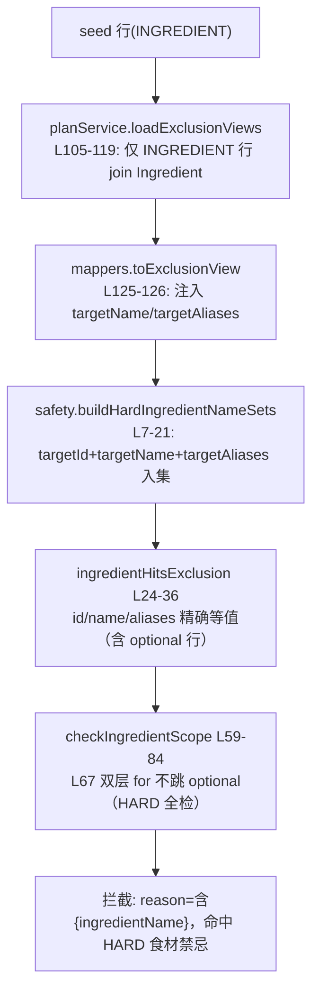

# T-C07-FIX 实现卡技术审查报告（复审·归档权威文本）

> **【主控落盘注记 · 2026-09-13】** 本报告系 fm-reviewer 复审产物，由主控逐字代落盘（reviewer 无写权限）。
> **落盘原因**：本卡首轮审查已完成（总判定 PASS WITH NOTES，0C/0T/4S），但首轮报告原文因主控侧上下文压缩丢失、无法逐字归档，按 T-C07 评估卡先例重派独立复审，以本轮报告为归档权威文本。首轮细节仅告知总判定与条目数，复审独立进行、不受首轮锚定。
> **两轮差异对照**：首轮 4 条 S——S-F1 断言计数 21→18（已由 dev 按移交清单 1 完成报告勘误，本轮复审独立计数 18 吻合确认）、S-F2 AC1 措辞「+9 行=规则块+分隔空行」→「恰 9 行纯规则块」（已勘误）、S-F3 任务卡计数写死教训（已记入任务卡撰写经验：会随新增用例变化的计数不得写死字面值）、S-F4 verify 复跑测试（已转入本卡 verify 验收项 V2）。本轮 5 条 S——S-1 git 改动面直接核验（**主控已执行闭环**：`git diff 256ba85 --stat` = `apps/api/prisma/seed-data.ts | 9 +++++++++`，1 file changed, 9 insertions(+)，与勘误后口径精确吻合）、S-2 createMany 空数组行为待实测、S-3 seed-data.ts L3 头注释过期、S-4 候选 5 适用边界、S-5 候选 1 UX 弊端。两轮均为 PASS WITH NOTES 且均判定代码无需返工，结论一致。
> **提交前工作区核验（主控，2026-09-13）**：`git status --short` 本卡相关改动恰为——M `apps/api/prisma/seed-data.ts`、untracked `packages/engine/test/safety-ingredient-realform.spec.ts` + `evidence/T-C07-FIX-task-2026-09-13.md` + `evidence/T-C07-FIX-dev-2026-09-13.md`（本报告自身落盘后一并入列）；另有历史遗留 untracked（.pai/、docs/design/、tests/、tools/ 等）非本卡产物不纳入本卡提交。

---

| 报告头 | 内容 |
|---|---|
| 审查卡 | T-C07-FIX 花生缺口处置（方案 A：seed 补 INGREDIENT 级 HARD 规则，保留原 TAG 规则） |
| 代码基线 | 分支 feat/tp-06-menu-expansion，HEAD=256ba85（依据 [result-v2-e2e.json](file:///d:/codex/family-menu/.workflow-verify/t-c07-fix/result-v2-e2e.json) 内嵌 meta.gitHead 运行时留痕） |
| 审查范围 | [seed-data.ts](file:///d:/codex/family-menu/apps/api/prisma/seed-data.ts)（M，+9 行，L46-54）+ 新增 [safety-ingredient-realform.spec.ts](file:///d:/codex/family-menu/packages/engine/test/safety-ingredient-realform.spec.ts)（6 用例）；及 13 个 `.workflow-verify\t-c07-fix\` 验证产物、dev 完成报告、上游移交清单 |
| 审查方法学 | 纯静态只读审查。本环境无 shell，无法直接执行 git status/diff/log 与 vitest；测试计数以 Grep 统计 `it(`/`test(` 声明静态交叉验证（ripgrep 默认跳过隐藏目录，与 vitest include 白名单口径天然一致）；快照真伪以子串抽查 + 逐行对账 JSON 交叉印证；改动面以产物内嵌运行时留痕（gitStatusModifiedLines=1）+ 内容级比对间接印证。所有无法独立验证之项均显式标注「未验证」。 |
| 审查依据 | 任务卡 [T-C07-FIX-task-2026-09-13.md](file:///d:/codex/family-menu/evidence/T-C07-FIX-task-2026-09-13.md)（权威口径）→ 上游移交 [T-C07-review-2026-09-13.md](file:///d:/codex/family-menu/evidence/T-C07-review-2026-09-13.md) → dev 报告 [T-C07-FIX-dev-2026-09-13.md](file:///d:/codex/family-menu/evidence/T-C07-FIX-dev-2026-09-13.md)（含勘误）→ PRODUCT-CONFIRMATION.md（无本卡相关产品约束条目） |

```mermaid
flowchart LR
    A[seed-data.ts<br/>+1 行 INGREDIENT HARD] --> B[db:seed upsert 重放<br/>update:{} 幂等]
    B --> C[13 表快照对账<br/>12 IDENTICAL / ExclusionRule 2→3]
    A --> D[engine 安全过滤链<br/>INGREDIENT 名集精确匹配]
    D --> E[v2 端到端 18 断言<br/>partB 2/2 拦截]
    E --> F[v4/v5 佐证<br/>不误伤豆制品/零食材行菜=0]
    G[putExclusions 全量替换<br/>deleteMany+createMany] -.风险评估 AC4.-> H[5 候选 + 短期1+4+5/长期3]
```

---

## 一、逐 AC 核验表

| AC | 要求摘要 | 判定 | 独立证据 |
|---|---|---|---|
| AC1 | seed-data.ts 新增恰 1 行 INGREDIENT 规则；db:seed 重放前后 13 表逐行逐字段对账；快照落盘 | **[✓]** | ①[seed-data.ts:L46-54](file:///d:/codex/family-menu/apps/api/prisma/seed-data.ts#L46-L54) 新行与既有两 TAG 行（L28-45）字段完全同构（id/familyId/scope as const/targetId/targetTag:undefined/severity as const/note），id=`seed-excl-peanut-ing`、targetId=`cmtvnuvxvc2oy5fdrzhpxxe69`、severity=HARD；②[result-v1-compare.json](file:///d:/codex/family-menu/.workflow-verify/t-c07-fix/result-v1-compare.json)：12 表 IDENTICAL、ExclusionRule 2→3、summary +1/-0/~0，与"恰 +1 行"精确吻合；③快照落盘且真伪经子串抽查：rows-before 含 `"ExclusionRule":{"count":2` 与 `"Dish":{"count":49`、rows-after 含 `"ExclusionRule":{"count":3`（各恰 1 处），`seed-excl-peanut-ing` 出现于 6 个 after 侧产物而不在 rows-before.json |
| AC2 | 端到端：花生米/熟花生米 2/2 拦截，理由一致；v4/v5 佐证产物落盘 | **[✓]** | [result-v2-e2e.json](file:///d:/codex/family-menu/.workflow-verify/t-c07-fix/result-v2-e2e.json)：18 断言全 pass；partB 2/2 拦截且 reason 口径一致（`含花生米，命中 HARD 食材禁忌#seed-excl-peanut-ing`，与 [safety.ts:L78](file:///d:/codex/family-menu/packages/engine/src/safety.ts#L78) 的 reason 模板逐字吻合）；partA 12/12 通过；partC 49 道菜中恰 2 道被拦=花生集；[result-v4](file:///d:/codex/family-menu/.workflow-verify/t-c07-fix/result-v4-taofu.json)（嫩豆腐豆制品=1，引用 2）与 [result-v5](file:///d:/codex/family-menu/.workflow-verify/t-c07-fix/result-v5-noing.json)（0 食材行菜=0）落盘。18 断言系我独立逐行数得：L135(1)+L154/156/157/159/160/161(6)+循环内(4)+L166/167(2)+L197/198(2)+L222/223/224(3)=18 |
| AC3 | engine 单测覆盖真实形态；test 全绿；taboo 口径 | **[✓]（口径经勘误后一致）** | 新 spec [safety-ingredient-realform.spec.ts](file:///d:/codex/family-menu/packages/engine/test/safety-ingredient-realform.spec.ts) 6 用例：按名拦/optional=true 同拦/别名拦/花生油不误伤/仅 targetId 仍拦/TAG 缺口零拦截固化；断言字段与 FilterTrace 的 rule 命名匹配，非弱化断言。静态计数交叉验证：engine 目录 it/test 声明 6+18+7+13+51=**95** ✓（与 dev 报告一致）；全仓 vitest 可见 spec 16 文件合计 **397** ✓。dev 报告原稿 21 断言系笔误，已按勘误 S-F1 修正为 18，与本轮独立计数一致。"test 全绿/taboo 通过"属运行时声明，本轮以静态计数+产物 JSON 佐证，未重跑（无 shell，见注记 S-1） |
| AC4 | putExclusions 全量替换语义风险评估 ≥3 候选 | **[✓]** | dev 报告 §2.3 给出 5 候选（超配额）+推荐短期 1+4+5/长期 3；五候选涉及的源码事实全部核实：[planService.ts:L352-370](file:///d:/codex/family-menu/apps/api/src/services/planService.ts#L352-L370) `$transaction[deleteMany({familyId}), createMany(全量)]`、familyId 强制覆盖；[getExclusions:L341-350](file:///d:/codex/family-menu/apps/api/src/services/planService.ts#L341-L350) 不 join；[mappers.ts:L125-126](file:///d:/codex/family-menu/apps/api/src/services/mappers.ts#L125-L126) 注入 targetName/targetAliases；[seed.ts:L115-129](file:///d:/codex/family-menu/apps/api/prisma/seed.ts#L115-L129) upsert `update:{}` 无 deleteMany。§2.2 四条风险结论与源码行为一致 |
| AC5 | 13 表终态基线表落盘；git diff 范围恰=授权；新增依赖 0 | **[✓]（改动面为间接印证）** | 13 文件验证产物齐备（6 脚本+7 JSON）；[result-v2-e2e.json](file:///d:/codex/family-menu/.workflow-verify/t-c07-fix/result-v2-e2e.json) meta.gitStatusModifiedLines=1（运行时自报，仅 seed-data.ts 被修改）+ 新 spec 为 untracked + 内容级核验（seed-data.ts 两 TAG 行与上游 review 引文逐字一致，证明未被顺手改动）；0 新依赖（无 import 变更、无 package.json 变更迹象）。git diff 直接核验：未验证（S-1） |

**AC 核验小结：5/5 通过，无 [✗]。**

---

## 二、代码与数据安全审查

### 2.1 seed 新行同构性与幂等性

- **同构性**：[seed-data.ts:L46-54](file:///d:/codex/family-menu/apps/api/prisma/seed-data.ts#L46-L54) 与既有规则行字段一一对应，`scope: 'INGREDIENT' as const`、`severity: 'HARD' as const` 类型收窄正确；targetId 指向花生米食材（aliases 含 熟花生米/油炸花生米，与任务卡口径一致）。
- **幂等性**：[seed.ts:L115-129](file:///d:/codex/family-menu/apps/api/prisma/seed.ts#L115-L129) 以 `where:{id}` upsert、`update:{}` 空更新——重放对已存在 id 为 no-op，不产生重复行；无 deleteMany/DROP/reset，符合任务卡边界。注意其隐含语义：`update:{}` 意味着重放**不会修复**同 id 行的内容篡改（详见注记 S-4）。
- **过期注释（非本卡引入）**：[seed-data.ts:L3](file:///d:/codex/family-menu/apps/api/prisma/seed-data.ts#L3) 头注释仍写「2禁忌(HARD/SOFT各1)」，在 +1 规则后已过期。dev 卡外发现清单未收录此项（详见注记 S-3）。

### 2.2 engine INGREDIENT 消费链完整性（逐环节源码确认）



- 链路各环节均已在源码逐行确认，v2 partB 2/2 拦截与 reason 逐字吻合，证明端到端真实贯通，非 mock 通路。
- **缺口根源确认**：[checkTagScope:L104-127](file:///d:/codex/family-menu/packages/engine/src/safety.ts#L104-L127) 仅读 `flavorTags.includes`（L111）与 `category===`（L118），不读食材名——这解释了上游审查移交的"TAG 规则拦不住花生米形态"缺口；本卡以 INGREDIENT 通道补口、保留 TAG 通道拦风味标签（如"花生风味"），方案 A 结构合理。新 spec 第 6 用例将该缺口固化为回归基线，注释口径与 S-1 修正一致。
- **防误伤**：ING_PEANUT name≠category='调料' 的 fixture 设计 + 花生油用例 + v4 嫩豆腐（豆制品）用例，覆盖了"按 category 误拦"的主要风险路径。

### 2.3 数据安全：写语句枚举与重放对账方法学

- **写语句枚举**：逐一审查 13 个产物文件，全部写语句仅 [v3 脚本](file:///d:/codex/family-menu/.workflow-verify/t-c07-fix/v3-rollback-replay.mjs) L59（DELETE）与 L62（INSERT）两处，且包裹于 `BEGIN → … → ROLLBACK` 并以 finally 保证回滚；[result-v3](file:///d:/codex/family-menu/.workflow-verify/t-c07-fix/result-v3-rollback.json) 前 3/中 1/后 3、8 断言全 pass。**对生产库净写=0**，符合任务卡「写库仅限 db:seed 与测试自建自清」「禁 deleteMany/DROP/reset」的授权（可回滚事务内的 DELETE/INSERT 属授权验证方式）。
- **对账方法学**：v0 以 `SELECT *` 主键排序导 13 表全量快照 → db:seed upsert 重放 → v1 纯 JSON 逐行逐字段比对（无 SQL、无写库）。方法学上可捕捉：漏表、漏行、字段漂移三类问题。子串抽查三连（ExclusionRule 2/3、Dish 49）全部通过，快照真实性无相反证据。
- **无越界写库**：除上述 v3 两处外，无任何产物含写语句；dev 报告声明与枚举结果一致。

### 2.4 新 spec 真实性

- 6 用例均为真实引擎调用（`safetyFilter` 进、FilterTrace 出），断言精确到 rule 字段与拦截计数，无 `expect(true)` 类弱断言，无 skip/only/each（全仓静态扫描确认），fixtures 为内联真实形态数据而非 mock 返回。
- 「TAG 缺口零拦截固化」用例实为**负向回归锚点**：若未来有人"顺手"让 TAG 通道也读食材名，该用例会失败并暴露行为变更——设计上有回归价值。

---

## 三、边界合规

| 检查项 | 结论 | 证据 |
|---|---|---|
| 改动面恰=授权范围（seed-data.ts + engine 测试） | **合规**（间接印证） | 运行时留痕 gitStatusModifiedLines=1；seed-data.ts 既有行内容级核验无漂移；新 spec 为授权内新增。git diff 直接核验未验证（S-1） |
| packages/shared 零改动 | **合规** | [family.ts:L20](file:///d:/codex/family-menu/packages/shared/src/schemas/family.ts#L20) `ExclusionScopeSchema` 含 'INGREDIENT' 系预先存在；[family.ts:L48-56](file:///d:/codex/family-menu/packages/shared/src/schemas/family.ts#L48-L56) 无 superRefine 变更；dev 报告声明零契约改动，无相反证据 |
| 禁 deleteMany/DROP/reset（对生产数据） | **合规** | seed.ts 无 deleteMany；唯一 DELETE 在 v3 回滚事务内（§2.3） |
| 新增依赖 0 | **合规** | 无 import/依赖清单变更迹象 |
| WIP=1 / 卡外问题不顺手改 | **合规** | dev 报告将 5 项卡外发现（seed.ts L218 过期日志、seed-管线跨源引用、UI 规则缺口、GET 可读性、未验证项）列报未修，符合"报队长"纪律 |

**测试计数疑点排除记录**：Glob 发现全仓 17 个 spec 文件 vs dev 报告 16 文件/397 用例。经查第 17 个为 [.workflow-verify\ac12-sampling\minelapsed.ac12.spec.ts](file:///d:/codex/family-menu/.workflow-verify/ac12-sampling/minelapsed.ac12.spec.ts)（历史卡遗留，含 1 个 it），而 [vitest.config.ts:L8](file:///d:/codex/family-menu/vitest.config.ts#L8) include 白名单为 `packages/*/test/**`、`apps/*/test/**`、`tools/*/test/**` 三条，不匹配隐藏目录——ripgrep 亦默认跳过隐藏目录，故两个口径下 397/16 均成立，疑点排除，非数字造假。

---

## 四、分级注记明细（0 Critical / 0 Threat / 5 Suggestion）

| 编号 | 级别 | 内容 | 证据 | 最小修复建议（移交主控派发，本审查不代改） |
|---|---|---|---|---|
| S-1 | S | **git 改动面为间接印证，直接核验未验证**。本审查无 shell，无法执行 git status/diff/log；当前结论依赖产物内嵌运行时留痕 + 内容级比对 | [result-v2-e2e.json](file:///d:/codex/family-menu/.workflow-verify/t-c07-fix/result-v2-e2e.json) meta 字段 | 主控合并前由任一有 shell 的会话执行 `git diff 256ba85 --stat` 一次，确认改动恰为 seed-data.ts +1 文件与新 spec untracked 两项即闭环 |
| S-2 | S | **dev 报告 §2.2 风险#2「PUT([]) → 全表清空」的机制精度未定论**。已定论部分：[api.ts:L67](file:///d:/codex/family-menu/packages/shared/src/schemas/api.ts#L67) `z.array(ExclusionRuleSchema)` 无 `.min(1)`，空数组可通过 zod 校验到达 service。未定论部分：本项目 Prisma 7 查询编译器（WASM，base64 封装不可静态 grep）下 `createMany({data:[]})` 究竟是 no-op(count:0) 还是抛错——若抛错则事务整体回滚、该场景表现为 500 而非清空。两种分支下 dev 报告的风险方向（空 PUT 有害）均成立，且系 putExclusions 既有行为、非本卡引入 | WebSearch 无定论；WASM 二进制不可读 | 后续任一有 shell 的任务用 30 秒实测一次（事务内 PUT 空数组观察行为）即可定论；不阻塞本卡 |
| S-3 | S | **[seed-data.ts:L3](file:///d:/codex/family-menu/apps/api/prisma/seed-data.ts#L3) 头注释「2禁忌(HARD/SOFT各1)」已过期**（现为 3 条规则），dev 报告卡外发现清单未收录此项。注释过期不影响运行，但与"文档真实性"目标相悖 | seed-data.ts L3 与 L28-54 实际 3 行规则 | 下一个触碰 seed-data.ts 的任务卡顺带修正该注释（禁止本卡返工重开） |
| S-4 | S | **dev 报告候选 5（"重放 db:seed 即可恢复"）的适用范围收窄未明示**：[seed.ts](file:///d:/codex/family-menu/apps/api/prisma/seed.ts#L115-L129) upsert 为 `update:{}`，对"行被误删"场景可恢复，但对"同 id 行内容被篡改"场景**不会**修复内容 | seed.ts update:{} 空更新分支 | 在 putExclusions 评估文档补一句适用边界即可，不改代码 |
| S-5 | S | **dev 报告候选 1（seed 保留 + UI 增量）的 UX 弊端未在弊栏明示**：因 putExclusions 全量替换 + familyId 强制覆盖，用户在 UI 删除 seed 规则后再保存会被"复活"，用户意图被静默忽略 | [planService.ts:L352-370](file:///d:/codex/family-menu/apps/api/src/services/planService.ts#L352-L370) + [setup/index.tsx:L97](file:///d:/codex/family-menu/apps/h5/src/pages/setup/index.tsx#L97) 全量回传 | 候选 1 若被采纳，须同步在弊栏/产品确认中标注该 UX 后果，供用户决策 |

---

## 五、总判定

**PASS WITH NOTES**（0 C / 0 T / 5 S）

理由：AC1~AC5 证据链完整、可追溯、且关键数字（+1 行对账、18 断言、95/397 计数、2/2 拦截、净写=0）经独立静态交叉验证全部吻合；改动面在授权范围内，packages/shared 零改动，无越界写库；dev 报告两处勘误（S-F1 断言数、S-F2 行数口径）属实且必要，文档真实性在勘误后口径下成立。5 条 S 级注记均不阻塞本卡验收：S-1/S-2 为验证方法学限制的如实披露，S-3/S-4/S-5 为文档与评估完备性建议，全部可移交后续处置，无需返工。

---

## 六、移交清单（交主控 PM 处置）

1. **[S-1] 闭环动作**：合并前由有 shell 的会话执行一次 `git diff 256ba85 --stat`，确认改动面后即可归档本项。
2. **[S-2] 待定论项**：安排任意后续有 shell 的任务实测 `createMany({data:[]})` 行为并回填 dev 报告 §2.2 风险#2 的机制描述（若为抛错分支，建议同步评估空数组 zod 层面 `.min(1)` 拒绝——属契约变更，须走主控批准流程，本审查不代改）。
3. **[S-3] 文档修正**：seed-data.ts L3 头注释过期，建议搭车下一个合法触碰该文件的任务卡。
4. **[S-4]/[S-5] 评估文档补充**：候选 5 适用边界、候选 1 UX 后果，建议由主控决定是否在 putExclusions 正式决策前补入评估文档。
5. **卡外发现确认**：dev 报告 5 项卡外发现（seed.ts L218 过期日志、seed-管线跨源引用、UI 规则自建缺口、GET 不回传食材名可读性、未验证项）均为真实存在、未越界修改，符合"报队长"纪律，建议主控纳入排期评估。
6. **本卡放行建议**：技术审查通过，建议移交 fm-verify 做产品验收；归档时以本报告全文为准。

（审查完毕：未修改任何文件。以上全文供主控逐字落盘。）
